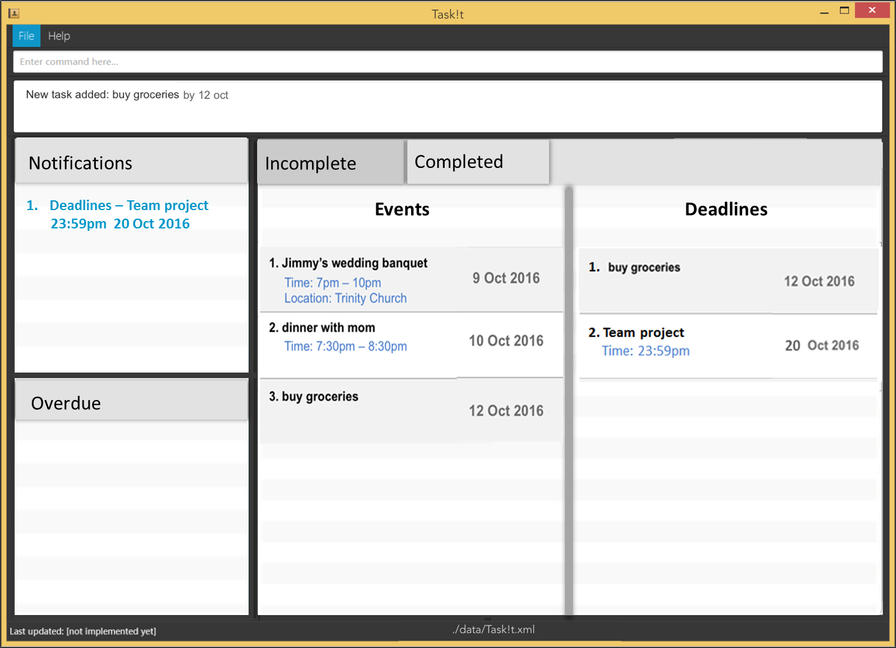

# Task!t

 

* This is a desktop Task Manager application. It has a GUI but most of the user interactions happen using 
  a CLI (Command Line Interface).
* The base code is taken from [Address Book (level 4)](https://github.com/nus-cs2103-AY1617S1/addressbook-level4). Below are some         description about Address Book (level 4):
  * It is a Java sample application intended for students learning Software Engineering while using Java as 
    the main programming language. 
  * It is **written in OOP fashion**. It provides a **reasonably well-written** code example that is 
    **significantly bigger** (around 6 KLoC)than what students usually write in beginner-level SE modules. 

  
#### Site Map
* [User Guide](docs/UserGuide.md) 
* [Developer Guide](docs/DeveloperGuide.md) 
* [Learning Outcomes](docs/LearningOutcomes.md) 
* [About Us](docs/AboutUs.md)
* [Contact Us](docs/ContactUs.md)

#### Acknowledgements

* Some parts of this sample application were inspired by the excellent 
  [Java FX tutorial](http://code.makery.ch/library/javafx-8-tutorial/) by *Marco Jakob*. 
* The sample project is created by the [SE-EDU](https://github.com/se-edu/) initiative.

#### Licence : [MIT](LICENSE)
