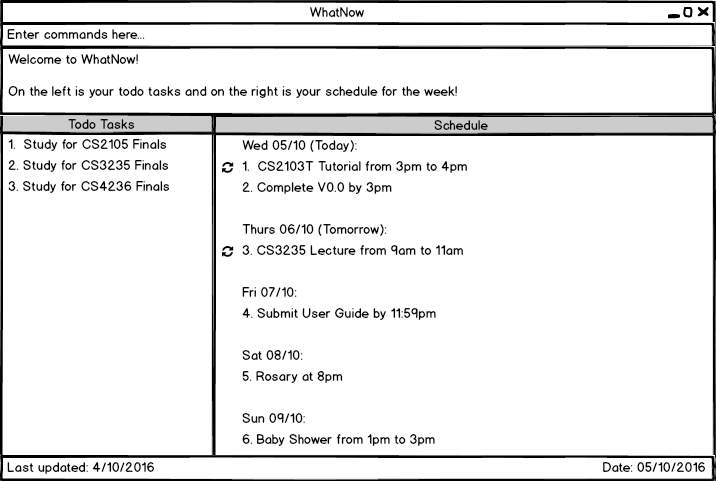

# WhatNow (V0.0)

 

Have you ever missed a deadline because you forgot to write it down? Have you ever forgot that you have to do something?

Don't worry! WhatNow will help you to remember your schedule and todos so that you will never miss a deadline or forget anything! It is a desktop application which allows you to store, retrieve and update your schedule and todos. All you need to do is to type a command and the output will be displayed in a Graphical User Interface (GUI).

It is intended for users who can type fast, spend most of the time near a computer, and prefer typing over mouse/voice commands.

  
#### Site Map
* [User Guide](docs/UserGuide.md) 
* [Developer Guide](docs/DeveloperGuide.md) 
* [Learning Outcomes](docs/LearningOutcomes.md) 
* [About Us](docs/AboutUs.md)
* [Contact Us](docs/ContactUs.md)

#### Acknowledgements

* Some parts of this application were inspired by the excellent 
  [Java FX tutorial](http://code.makery.ch/library/javafx-8-tutorial/) by *Marco Jakob*. 

#### Licence : [MIT](LICENSE)
