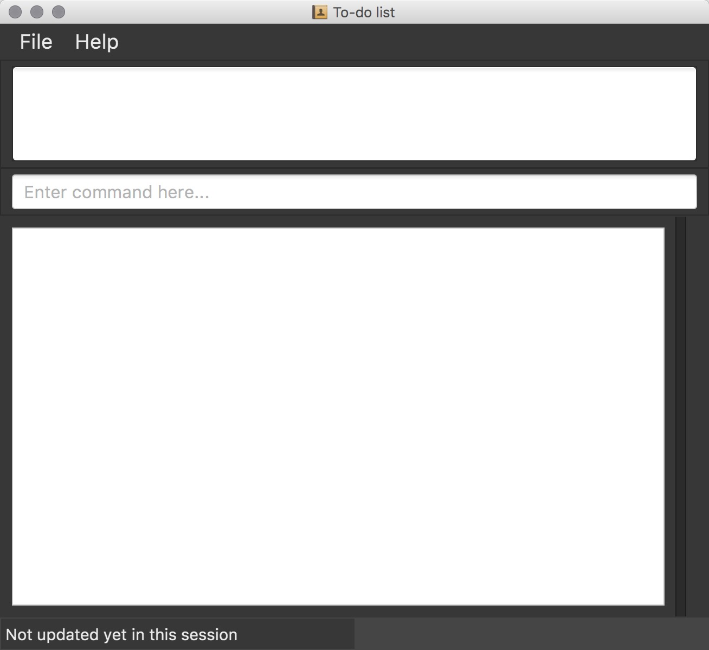

# Task Manager   

 

* Taskmanager, is a desktop to-do list application. It has a GUI but most of the user interactions happen using a CLI (Command Line Interface).
* It is written in Java programming language. 
* It provides a list of commands for user to manage their tasks and events, and tasks and events will be reflected by GUI
* It supports for *Build Automation* using [Gradle](https://gradle.org/) and for *Continuous Integration* using [Travis CI](https://travis-ci.org/).
  
#### Site Map
* [User Guide](docs/UserGuide.md) 
* [Developer Guide](docs/DeveloperGuide.md) 
* [About Us](docs/AboutUs.md)

#### Acknowledgements
* The code base was based on [addressbook-level4](https://github.com/se-edu/addressbook-level4). 
* Some parts of this sample application were inspired by the excellent 
  [Java FX tutorial](http://code.makery.ch/library/javafx-8-tutorial/) by *Marco Jakob*. 

#### Licence : [MIT](LICENSE)