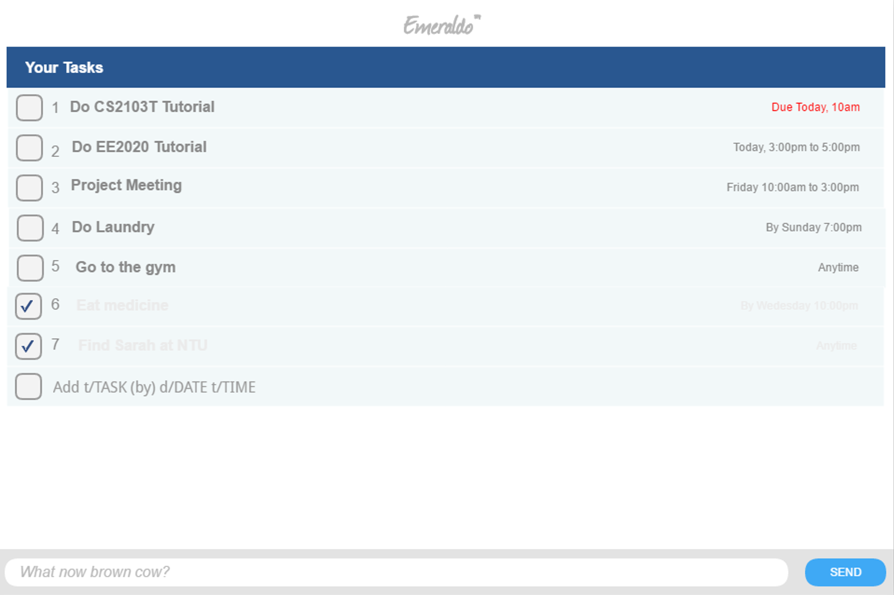

 
# Emeraldo

## GUI mockup
 
This is the Start Up Page  

* This is a desktop Task Manager application. It has a GUI but most of the user interactions happen using 
  a CLI (Command Line Interface).
* It is a simple Java application intended for students to learn Software Engineering while using Java as 
  the main programming language.

  
#### Site Map
* [User Guide](docs/UserGuide.md) 
* [Developer Guide](docs/DeveloperGuide.md) 
* [About Us](docs/AboutUs.md)

#### Acknowledgements

* Some parts of this simple application were inspired by the
  [Address Book (Level 4)](https://github.com/nus-cs2103-AY1617S1/addressbook-level4) sample application
  and the sample project created by SE-EDU initiative at https://github.com/se-edu/
