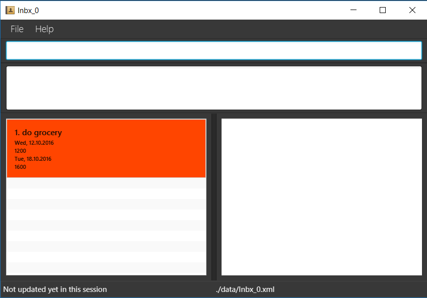

# DoDo-Bird

* **DoDo-Bird** is a desktop TO-DO application. It has a GUI but most of the user interactions happen using a CLI (Command Line Interface). With **DoDo-Bird**, you can focus on what is important in your life.

#### Want to use DoDo-Bird ?
* [Download the latest release](https://github.com/CS2103AUG2016-W13-C1/main/releases)
* [User Guide](docs/UserGuide.md)

#### Want to contribute to DoDo-Bird ?
* [Developer Guide](docs/DeveloperGuide.md)
* [About Us](docs/AboutUs.md)
* [Contact Us](docs/ContactUs.md)

#### Acknowledgements

* Some parts of this application were inspired by the excellent
  [Java FX tutorial](http://code.makery.ch/library/javafx-8-tutorial/) by *Marco Jakob*.

* The application uses [Natty Date Parser](https://github.com/joestelmach/natty) for natural language date parsing.

* This project is an extension to the original project addressbook-level4
created by SE-EDU initiative at https://github.com/nus-cs2103-AY1617S1/addressbook-level4

#### Licence : [MIT](LICENSE)
