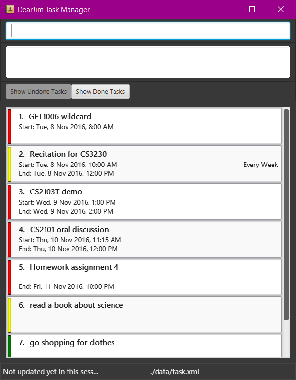

# DearJim

 

Introducing *DearJim* - a revolutionary task manager designed to help you organise your tasks that is simple and easy to use. *DearJim* is targeted at users who prefer to type and users who are more comfortable with keyboard based commands.

*DearJim* functions purely through keyboard inputs - no more fumbling around trying to look for the right button to press, simply enter a command and press <kbd>Enter</kbd>! *DearJim* also supports different types of tasks, such as tasks with deadlines, tasks without deadlines, tasks with start and end time and even recurring tasks. 

  
#### Site Map
* [User Guide](docs/UserGuide.md) 
* [Developer Guide](docs/DeveloperGuide.md) 
* [About Us](docs/AboutUs.md)
* [Contact Us](docs/ContactUs.md)

#### Acknowledgements

* The code base behind this project was forked from 
  [addressbook-level4](https://github.com/nus-cs2103-AY1617S1/addressbook-level4).
  
* To allow for natural date inputs, we use the excellent natural language date parser library [natty](http://natty.joestelmach.com/).

* Some parts of this application were inspired by the excellent 
  [Java FX tutorial](http://code.makery.ch/library/javafx-8-tutorial/) by *Marco Jakob*. 

