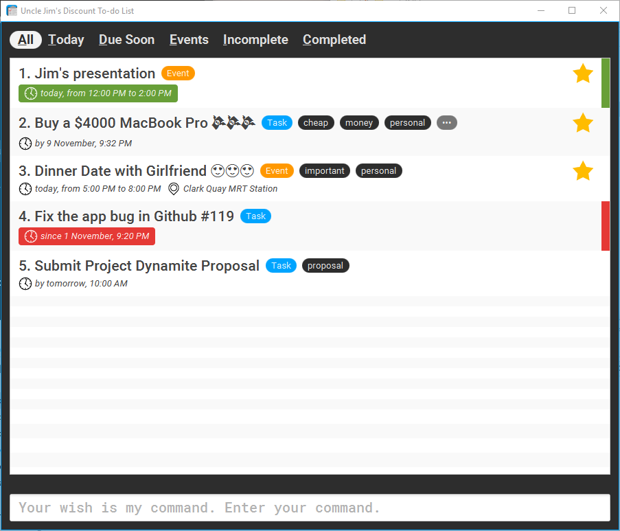

 

 

#### Current Release: [v0.5 Grand Prix][release] (Release version) 

#### About Uncle Jim's Discount To-do List

* This is a command-based to-do list app for users who relies a lot on keyboards, just like [Jim](http://www.comp.nus.edu.sg/~cs2103/AY1617S1/).
* It features a DOS-like command line interface as the main form of input, and a graphical user interface (GUI) as the primary output to display your list of tasks and events.
* It is a Java 8 application built with JavaFX.

  
#### Site Map
* [User Guide](https://cs2103aug2016-w10-c4.github.io/main/UserGuide.html) 
* [Developer Guide](https://cs2103aug2016-w10-c4.github.io/main/DeveloperGuide.html) 
* [About Us](docs/AboutUs.md)
* [Contact Us](docs/ContactUs.md)

#### Acknowledgements

* This project was based on [Address Book (Level 4)](https://github.com/nus-cs2103-AY1617S1/addressbook-level4).
* This project uses a number of external third-party libraries, building on the shoulder of giants: 
    - PrettyTimeNLP: http://www.ocpsoft.org/prettytime/nlp/
    - TestFX: https://github.com/TestFX/TestFX
    - JUnit: http://junit.org/junit4/
    - Faker: https://github.com/DiUS/java-faker
    - Mockito: http://mockito.org/
    - Jackson: https://github.com/FasterXML/jackson
    - Google Core Libraries: https://github.com/google/guava
    - Apache Commons: https://commons.apache.org/ 
    - Evo Inflector: https://github.com/atteo/evo-inflector/
    

#### Licence : [MIT](LICENSE)

[release]: https://github.com/CS2103AUG2016-W10-C4/main/releases/tag/v0.5 
