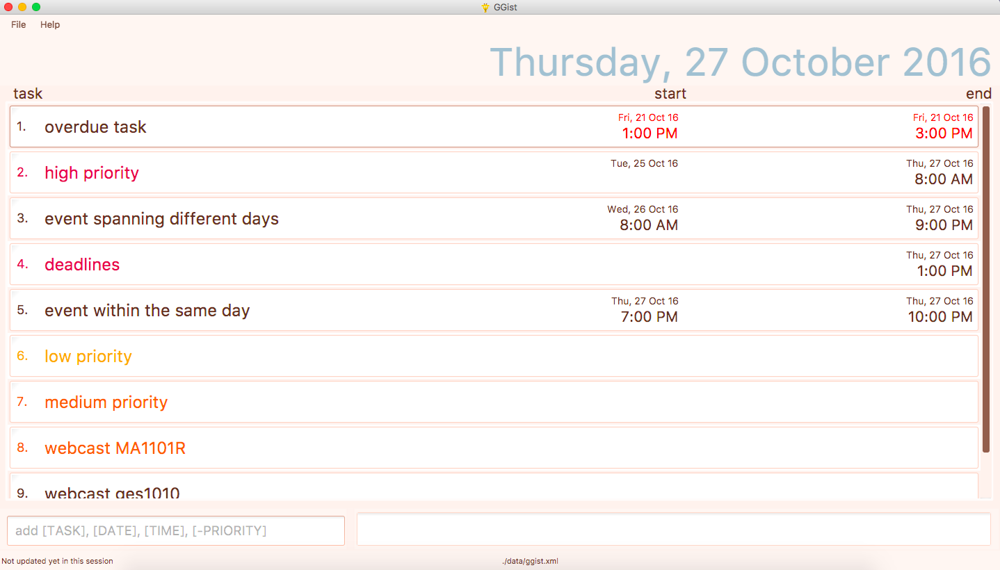

# GGist

 

* This is a desktop Task Manager application. It has a GUI but most of the user interactions happen using 
  a CLI (Command Line Interface).
* It is a Java sample application written by a team of NUS 2nd year Computer Science undergraduates using Java as 
  the main programming language. 
* It is **written in OOP fashion** for a beginner-level SE module.
  
#### Site Map
* [User Guide](docs/UserGuide.md) 
* [Developer Guide](docs/DeveloperGuide.md) 
* [Learning Outcomes](docs/LearningOutcomes.md) 
* [About Us](docs/AboutUs.md)
* [Contact Us](docs/ContactUs.md)

#### Acknowledgements

The [Address Book Level 4](https://github.com/se-edu/addressbook-level4) sample project created by SE-EDU initiative.

#### Licence : [MIT](LICENSE)
