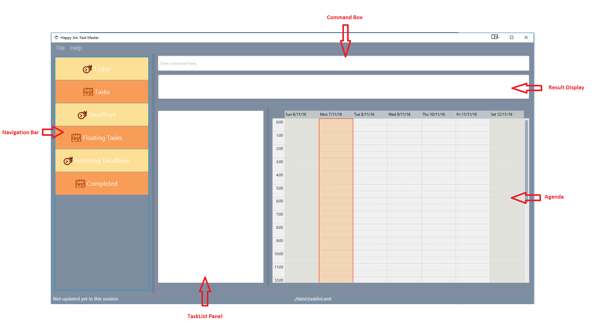

# HappyJimTaskMaster

 

* This is a desktop task manager application. It has a GUI but most of the user interactions happen using 
  a CLI (Command Line Interface).
* It is a Java application intended for people who prefer to use keyboard to manage their tasks.

#### Site Map
* [User Guide](docs/UserGuide.md) 
* [Developer Guide](docs/DeveloperGuide.md) 
* [About Us](docs/AboutUs.md)
* [Contact Us](docs/ContactUs.md)

#### Acknowledgements

* Some parts of this sample application were inspired by the excellent 
  [Java FX tutorial](http://code.makery.ch/library/javafx-8-tutorial/) by *Marco Jakob*. 
* The sample project created by SE-EDU initiative at https://github.com/se-edu/
* Natural language date parser [Natty](http://natty.joestelmach.com/)
* Some parts of the user guide were inspired by CS2103AUG2016-W09-C3

#### Licence : [MIT](LICENSE)
