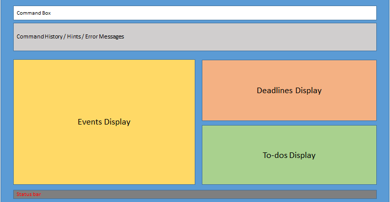

# Address Book (Level 4)

 

* This is a desktop Address Book application. It has a GUI but most of the user interactions happen using 
  a CLI (Command Line Interface).
* It is a Java sample application intended for students learning Software Engineering while using Java as 
  the main programming language. 
* It is **written in OOP fashion**. It provides a **reasonably well-written** code example that is 
  **significantly bigger** (around 6 KLoC)than what students usually write in beginner-level SE modules. 
  
#### Site Map
* [User Guide](docs/UserGuide.md) 
* [Use Cases and Stories] (docs/UserStoriesCases.md)
* [Product Surveys] (docs/ProductSurveys.md)
* [Developer Guide] (docs/DeveloperGuide.md)
* [About Us](docs/AboutUs.md)

#### Acknowledgements

* Some parts of this sample application were inspired by the excellent 
  [Java FX tutorial](http://code.makery.ch/library/javafx-8-tutorial/) by *Marco Jakob*. 
* Original source code was taken from the sample project created by SE-EDU initiative at (https://github.com/se-edu/)

#### Licence : [MIT](LICENSE)
