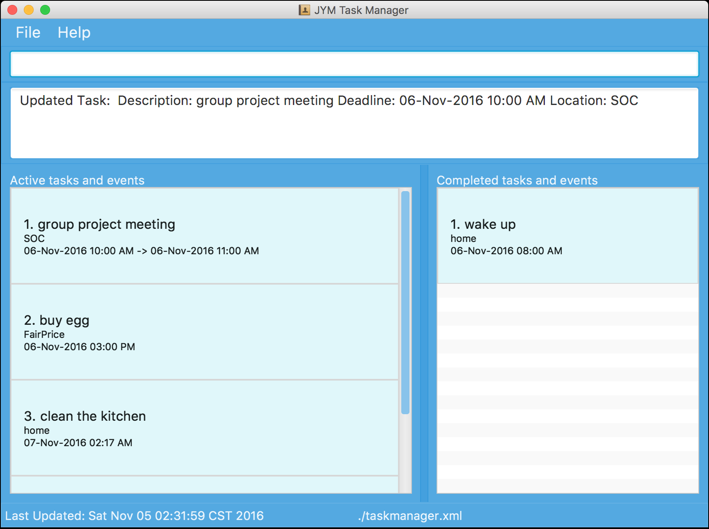

<!--- @@author a0153617e -->

# JYM

 

* This is a desktop task management application. It has a GUI but most of the user interactions happen using 
  a CLI (Command Line Interface).
  
#### Site Map
* [User Guide](docs/UserGuide.md) 
* [Developer Guide](docs/DeveloperGuide.md) 
* [About Us](docs/AboutUs.md)
* [Contact Us](docs/ContactUs.md)

#### Acknowledgements

* Some parts of this sample application were inspired by these excellent 
  [Addressbook Repositories](https://github.com/se-edu/) by *Damith C. RAJAPAKSE*. 

#### Licence : [MIT](LICENSE)
