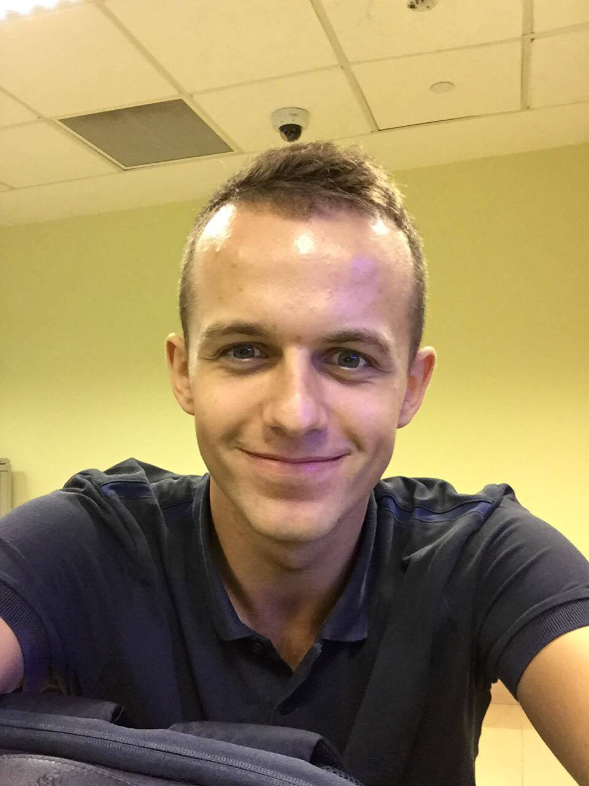
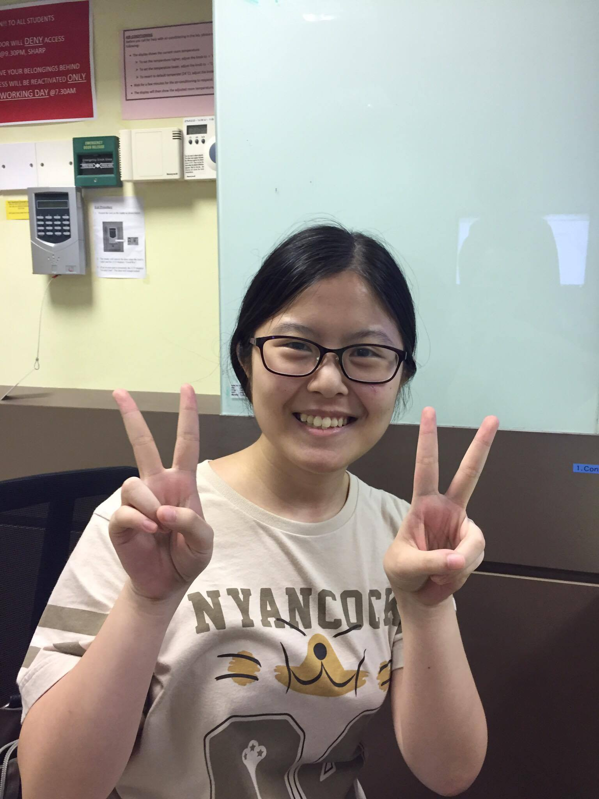
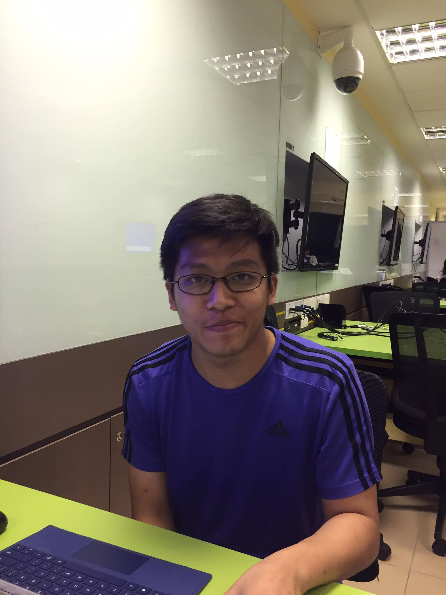
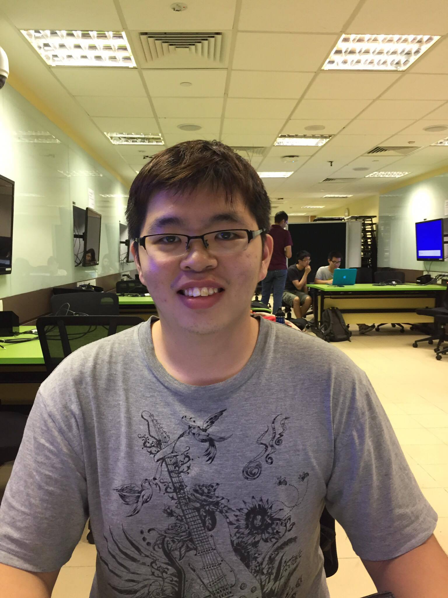

# About Us

We are Team of T15-C1 based in the [School of Computing, National University of Singapore](http://www.comp.nus.edu.sg).

## Project Team

#### [Ang Kiang Siang](https://docs.google.com/document/u/1/d/1O3HF7qsh6KVeLesPmcQ0nPxSqhrkJxvS-OA_g-k-two/pub?embedded=true)  
 
Role: Project Mentor   

-----

	//@@author A0153411W
#### [Bartlomiej Wozniak](https://github.com/bartekwozniak93)  
 
**Role**: Team lead, Deliverables and deadline  
Responsibilities: Logic
* Features implemented:
   * [Undo method](https://github.com/CS2103AUG2016-T15-C1/main/blob/master/docs/UserGuide.md#undo-method--undo)
   * [Adding duplicated tasks](https://github.com/CS2103AUG2016-T15-C1/main/blob/master/docs/UserGuide.md#adding-duplicated--add)
   * Code written: [functional code](https://github.com/CS2103AUG2016-T15-C1/main/tree/master/collated/main/A0153411W.md)
   [functional code reused](https://github.com/CS2103AUG2016-T15-C1/main/tree/master/collated/main/A0153411W-reused.md)
   [test code](https://github.com/CS2103AUG2016-T15-C1/main/tree/master/collated/test/A0153411W.md)
   [docs](https://github.com/CS2103AUG2016-T15-C1/main/tree/master/collated/docs/A0153411W.md)
  * Other major contributions:
  * Did the initial refactoring from AddressBook to ToDoList (https://github.com/CS2103AUG2016-T15-C1/main/commit/b304c004e97db51e95d14c6ca26801886a6c3be5) 
  * Set up Travis and Coveralls 
	//@@author
-----

#### [Choi Ying Ying](https://github.com/ychoi1997)  
 
Role: Documentation and Code Quality    
Responsibilities: UI

-----

#### [Irwan](https://github.com/nawri14)  
 
Role: Scheduling and tracking , Git expert    
Responsibilities: Data Storage

-----

#### [Desmond Tan](https://github.com/e0012764)  
 
Role: Testing and Integration    
Responsibilities: Logic

-----
