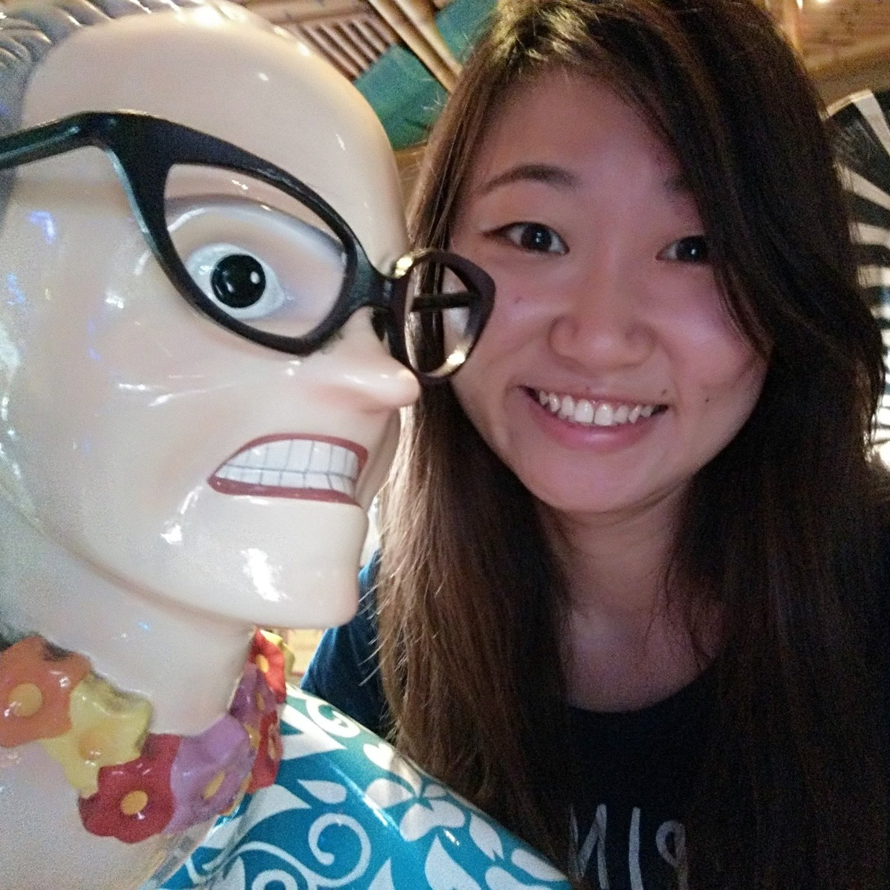
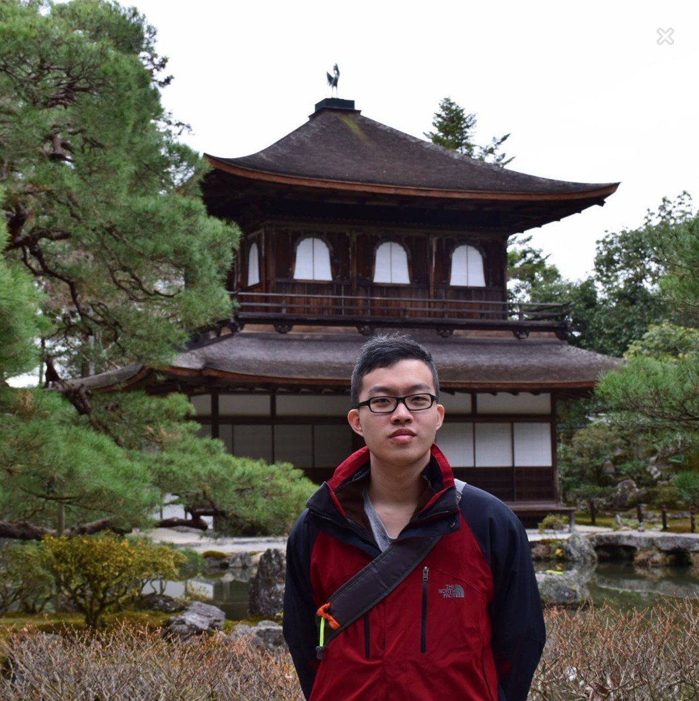

# About Us

We are a team based in the [School of Computing, National University of Singapore](http://www.comp.nus.edu.sg).

## Project Team

#### [Akshay Narayan](http://www.comp.nus.edu.sg/~anarayan/)  
 
**Role**: Project Advisor

-----

#### [Gao Yu](https://github.com/GaoYu-Karen)
 
Role: Developer    
Responsibilities: UI

-----

#### [Ong Qi Yong](https://github.com/oqyxxy) 
 
Role: Developer    
Responsibilities: Logic

-----

#### [Yu Xiaodong](https://github.com/yxd117)
 
Role: Developer    
Responsibilities: Storage

-----

#### [Tarish Sekhon](https://github.com/TarishSekhon)
 
 Role: Developer    
 Responsibilities: Parser
 
 -----

# Contributors

We welcome contributions. See [Contact Us](ContactUs.md) page for more info.

* [Akshay Narayan](https://github.com/se-edu/addressbook-level4/pulls?q=is%3Apr+author%3Aokkhoy)
* [Sam Yong](https://github.com/se-edu/addressbook-level4/pulls?q=is%3Apr+author%3Amauris)