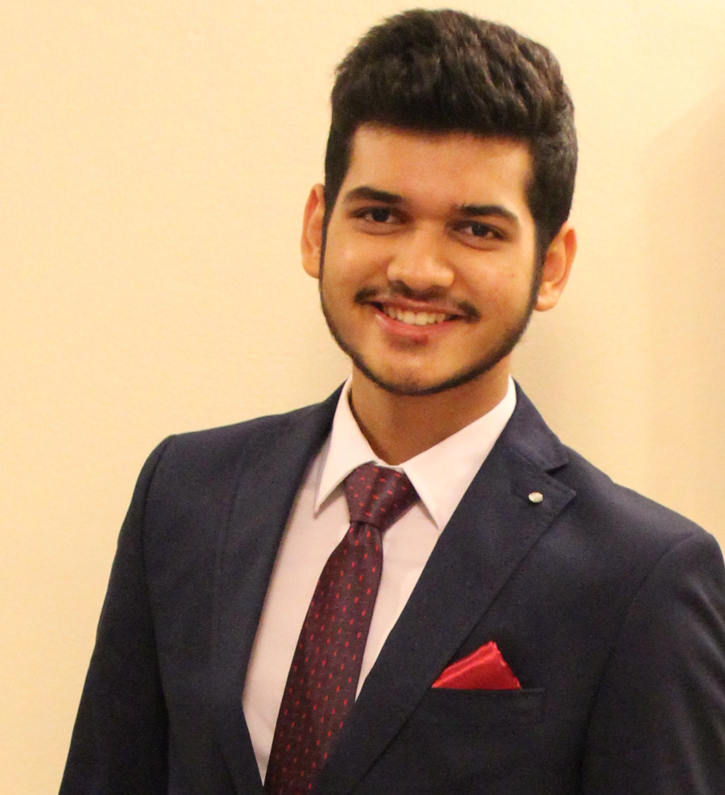

# About Us

We are a team of 4 Computer Engineering 2nd year students based in the [School of Computing, National University of Singapore](http://www.comp.nus.edu.sg).

## Project Team

#### [Shailesh Nahata](https://github.com/nahata-shailesh)  
 
**Role**: Developer  
**Responsibilities**: Parsing

-----

#### [Teh Chee Yeo](https://github.com/cheo1994)
 
**Role**: Developer    
**Responsibilities**: Logic

-----

#### [Tan Jun Hao](https://github.com/e0003083)
**Role**: Developer    
**Responsibilities**: Storage

-----

#### [Qiang Yu](https://github.com/Hastyrush)
 
Role: Developer    
Responsibilities: UI

-----
