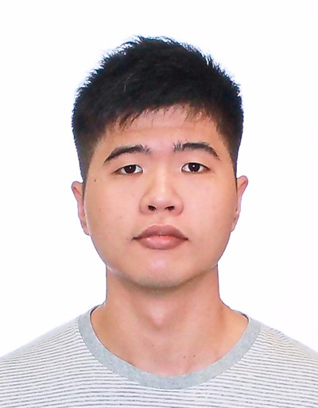

//@@author A0139128A
# About Us

We are a team based in the [School of Computing, National University of Singapore](http://www.comp.nus.edu.sg).

## Project Team

#### [Verbena Ong](http://github.com/Verbena) 
 
**Role**: Team Leader   
Responsibilities: Project coordination, Integration

-----

#### [Lim Wei Jie](http://github.com/1o0p3r)
 
**Role**: Developer   
Responsibilities: Testing of codes, Deliverables and deadlines

-----

#### [Patel Drashti](http://github.com/Drashti96)
 
**Role**: Developer   
Responsibilities: Documentation, Scheduling and tracking

-----

#### [Zachary Lim](http://github.com/zachylimwl)
 
**Role**: Developer   
Responsibilities: Coding lead

-----

## Project Mentor

#### [Akshay Narayan](https://github.com/okkhoy) 
 

-----

# Contributors

We welcome contributions. See [Contact Us](ContactUs.md) page for more info.
* [Damith C. Rajapakse](http://www.comp.nus.edu.sg/~damithch/)
* [Joshua Lee](https://github.com/lejolly)
* [Leow Yijin](https://github.com/yijinl)
* [Martin Choo](https://github.com/m133225)
* [Thien Nguyen](https://github.com/ndt93)
* [You Liang](https://github.com/yl-coder)
* [Akshay Narayan](https://github.com/se-edu/whatnow-level4/pulls?q=is%3Apr+author%3Aokkhoy)
* [Sam Yong](https://github.com/se-edu/whatnow-level4/pulls?q=is%3Apr+author%3Amauris)