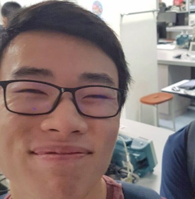

# About Us

We are a team based in the [School of Computing, National University of Singapore](http://www.comp.nus.edu.sg).

## Project Team

#### Lee Jing He
 

* Components in charge of: [Model] (https://github.com/CS2103AUG2016-T10-C3/main/blob/master/docs/DeveloperGuide.md#model-component)
* Aspects/tools in charge of:
* Features implemented:
	* List categories or tags
	* ListAll categories or tags
	* Flexible command inputs for date and time
* Code written: 
[[functional code] (https://github.com/CS2103AUG2016-T10-C3/main/blob/master/collated/main/A0139749L.md)]
[[test code] (https://github.com/CS2103AUG2016-T10-C3/main/blob/master/collated/test/A0139749L.md)]
[[docs] (https://github.com/CS2103AUG2016-T10-C3/main/blob/master/collated/docs/A0139749L.md)]
* Other major contributions:
	* Did the initial refactoring from AddressBook to Emeraldo
	* Set up Travis and Coveralls
	* Formatting for markdown documents

 

#### Lim Khong Yew
 

* Components in charge of: [Storage] (https://github.com/CS2103AUG2016-T10-C3/main/blob/master/docs/DeveloperGuide.md#storage-component)
* Aspects/tools in charge of: Testing, Git
* Features implemented:
	* List persons
	* Delete person
	* Undo command
* Code written: 
[[functional code] (https://github.com/CS2103AUG2016-T10-C3/main/blob/master/collated/main/A0139342H.md)]
[[test code] (https://github.com/CS2103AUG2016-T10-C3/main/blob/master/collated/test/A0139342H.md)]
[[docs] (https://github.com/CS2103AUG2016-T10-C3/main/blob/master/collated/docs/A0139342H.md)]

* Other major contributions:

 

#### Lim Zhiming
 

* Components in charge of: [Logic] (https://github.com/CS2103AUG2016-T10-C3/main/blob/master/docs/DeveloperGuide.md#logic-component)
* Aspects/tools in charge of: Git
* Features implemented:
	* Edit tasks’ description, date & time and tags
* Code written: 
[[functional code]
(https://github.com/CS2103AUG2016-T10-C3/main/blob/master/collated/main/A0139196U.md)]
[[test code]
(https://github.com/CS2103AUG2016-T10-C3/main/blob/master/collated/test/A0139196U.md)]
[[docs]
(https://github.com/CS2103AUG2016-T10-C3/main/blob/master/collated/docs/A0139196U.md)]
* Other major contributions: 

 

#### Ng Kai Sing
 

* Components in charge of: [UI] (https://github.com/CS2103AUG2016-T10-C3/main/blob/master/docs/DeveloperGuide.md#ui-component)
* Aspects/tools in charge of: Git
* Features implemented:
	* Complete Command
	* FindAll Task
	* Overdue/Event Context for DateTime Class
* Code written:
[[functional code]
(https://github.com/CS2103AUG2016-T10-C3/main/blob/master/collated/main/A0142290N.md)]
[[test code]
(https://github.com/CS2103AUG2016-T10-C3/main/blob/master/collated/test/A0142290N.md)]
[[docs]
(https://github.com/CS2103AUG2016-T10-C3/main/blob/master/collated/docs/A0142290N.md)]
* Other major contributions:

 

## Project Mentor

#### Sam Yong
 
