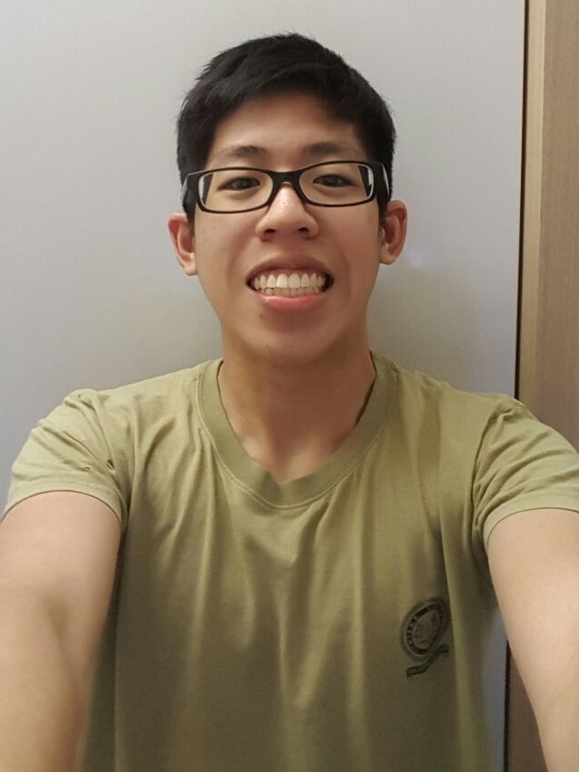
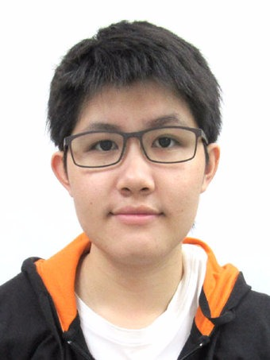
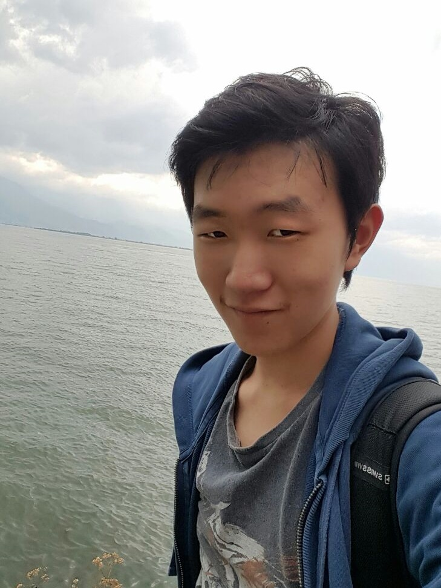

# About Us

We are the team in charge of developing Jimi, a command-line based task manager that is designed for fast typers.  
  Our team of four, comprises computer engineers taking a stab at software engineering. We are familar with both OOP and Java - evidently from our code.  
 [**Clarence**](#clarence) is the team leader and is in charge of overseeing the overall project coordination as well as managing the integration of different components of the software made by the team.  
 [**Ze Xuan**](#zexuan) is in charge of managing and assigning tasks to the team members as well as ensures that the project deliverables are completed on time.  
 [**Wei Yin**](#weiyin) takes charge of the overall documentation of the project, which includes the User Guide and the Developer Guide, among other things.  
 Lastly, [**Yun Xuan**](#yunxuan) looks after the overall code quality of the project and ensures that coding standards are met as well as proper testing of the product.  

## Project Team

#### Nirandika Wanigasekara(https://github.com/nirandiw)
 
**Role**: Project Mentor

-----

####  Clarence Chee [@cheec](https://github.com/cheec)
 
* Components in charge of : [Logic](https://github.com/CS2103AUG2016-T09-C2/main/blob/master/docs/DeveloperGuide.md#logic-component)
* Aspects/tools in charge of: Team Lead, Integration, Code quality control
* Features implemented:
    * [Add tasks/events](https://github.com/CS2103AUG2016-T09-C2/main/blob/master/docs/UserGuide.md#add)
    * [Edit tasks/events](https://github.com/CS2103AUG2016-T09-C2/main/blob/master/docs/UserGuide.md#edit)
    * [Set new save directory](https://github.com/CS2103AUG2016-T09-C2/main/blob/master/docs/UserGuide.md#saveas)
* Code written:[[functional code](A0140133B.md)][[test code](A0140133B.md)][[docs](A0140133B.md)]
*  Other major contributions:
    * Set up JimiParser
    * Set up FilteredListManager
    * Morph Model and ModelManager
    * Update EditCommand parsing of updated commands
    * Implement Natty

-----

####  Chong Ze Xuan [@syltaris](http://github.com/syltaris) 
 
* Components in charge of : [UI](https://github.com/CS2103AUG2016-T09-C2/main/blob/master/docs/DeveloperGuide.md#ui-component)
* Aspects/tools in charge of: Scheduling and Tracking, Deliverables and Deadlines, Git
* Features implemented:
    * [Edit tasks/ events](https://github.com/CS2103AUG2016-T09-C2/main/blob/master/docs/UserGuide.md#edit)
    * [Show complete/incomplete tasks/events](https://github.com/CS2103AUG2016-T09-C2/main/blob/master/docs/UserGuide.md#show)
    * [Show tasks/events on a certain day](https://github.com/CS2103AUG2016-T09-C2/main/blob/master/docs/UserGuide.md#show)
    * [Complete a task/event](https://github.com/CS2103AUG2016-T09-C2/main/blob/master/docs/UserGuide.md#com)
* Code written:[[functional code](A0138915X.md)][[test code](A0138915X.md)][[docs](A0138915X.md)] 
* Other major contributions:
    * Morph Model and ModelManager
    * Set up the fixing of tasks
    * Implement AgendaListPanel and TaskListPanel for GUI
    * Create MainWindow layout
-----

####  Chong Wei Yin [@ShadowLoner17](https://github.com/ShadowLoner17) 
 
* Components in charge of : [Storage](https://github.com/CS2103AUG2016-T09-C2/main/blob/master/docs/DeveloperGuide.md#storage-component)
* Aspects/tools in charge of: Documentation
* Features implemented:
    * [Delete tasks/ events](https://github.com/CS2103AUG2016-T09-C2/main/blob/master/docs/UserGuide.md#del)
    * [Set new save directory](https://github.com/CS2103AUG2016-T09-C2/main/blob/master/docs/UserGuide.md#saveas)
* Code written: [[functional code](A0143471L.md)][[test code](A0143471L.md)][[docs](A0143471L.md)] 
* Other major contributions:
    * Set tasks with priority
-----

####  Zhang Yunxuan [@yunz](https://github.com/yunxz)
 
* Components in charge of : [Model](https://github.com/CS2103AUG2016-T09-C2/main/blob/master/docs/DeveloperGuide.md#model-component)
* Aspects/tools in charge of: Testing, Code Quality Control
* Features implemented:
    * [Find task/event using keyword](https://github.com/CS2103AUG2016-T09-C2/main/blob/master/docs/UserGuide.md#find)
    * [Undo action](https://github.com/CS2103AUG2016-T09-C2/main/blob/master/docs/UserGuide.md#undo)
    * [Redo action](https://github.com/CS2103AUG2016-T09-C2/main/blob/master/docs/UserGuide.md#redo)
* Code written: [[functional code](A0148040R.md)][[test code](A0148040R.md)][[docs](A0148040R.md)] 
* Other major contributions:
    * Set up Travis
    * Create DateTime class for Events
    * Implement Natty

-----