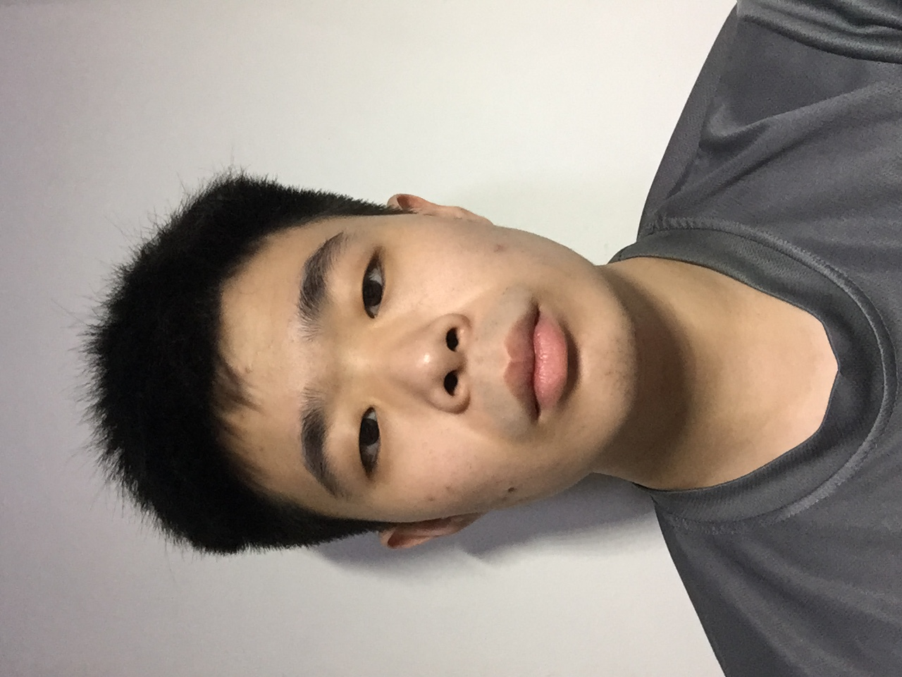
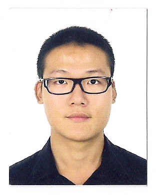

# About Us

We are a team of four computer engineering students based in the [School of Computing, National University of Singapore](http://www.comp.nus.edu.sg).

## Project Team

###Project Mentor :  Nirandika Wanigasekara  

 

-----

#### Lim Wei Ming Ronald

 
**Role**: Team Leader  
Responsibilities: Documentation, Deliverables and Deadlines, Scheduling and Tracking

Components in charge of: UI

* Features Implemented: 
	* Set storage folder 
	* Undo and Redo 
	* List

Code written: [functional code](/collated/main/A0147890U.md)  
[docs](A0147890U.md)

* Other major contributions: 
	* Implemented the initial edit task command
	* Set up Travis and Coveralls
	
-----

#### Zavier Ong 
 
Role: Developer    
Responsibilities: Code Integration

Components in charge of: Logic
* Features Implemented: 
	* Add task commands
	* Select commands
	* DateTime support

Code written: [[functional code](A0138993L.md)][[test](A0138993L.md)][[docs](A0138993L.md)]

* Other major contributions: 
	* Editing Parser for task manager
	* Wrote test cases
	* Wrote GUI test cases

-----

#### Hu JingRui
 
Role: Developer    
Responsibilities: Testing

Components in charge of: Model
* Features Implemented: 
	* Find task
	* Delete task
	* Edit task
	* Add tag
	
Code written: [[functional code](A0139430L JingRui.md)][[test](A0139430L JingRui.md)][[docs](A0139430L JingRui.md)]

* Other major contributions: 
	* Wrote test cases
	* Sorting of task lists

-----

#### Li Zhiyuan
 
Role: Developer    
Responsibilities: Code Quality, Tool Expert

Components in charge of: Storage
* Features Implemented: 
	* Done command
	
Code written [[functional code](A0135722L Zhiyuan.md)]
	
	
-----
