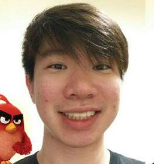

# About Us

We are a team based in the [School of Computing, National University of Singapore](http://www.comp.nus.edu.sg).

## Project Team

<!-- @@author A0093896H -->
#### [@Desmond Ang](https://github.com/KnewYouWereTrouble)
 
* Components in charge of: Model, Logic, Storage  
* Aspects/tools in charge of: Testing, Git  
* Features Implemented:
    * Add Command
    * Delete Command
    * Undo Command
    * Update Command
    * Recurring Tasks
* Code Written: [[functional code]](https://github.com/CS2103AUG2016-W13-C1/main/blob/master/collated/main/A0093896H.md)
[[test code]](https://github.com/CS2103AUG2016-W13-C1/main/blob/master/collated/test/A0093896H.md)
[[docs]](https://github.com/CS2103AUG2016-W13-C1/main/blob/master/collated/docs/A0093896H.md)

* Other major contributions
    * Did the initial refactoring from AddressBook to ToDoList
    * Set up Travis, Coveralls, Codacy

-----
<!-- @@author A0142421X -->
#### [@Dewi Tan Jia Hui](https://github.com/jessidew95)
 
* Components in charge of: UI, Logic  
* Aspects/tools in charge of: Scenebuilder  
* Features Implemented:
    * Tag List Panel
    * Tag Command
* Code Written: [[functional code]](https://github.com/CS2103AUG2016-W13-C1/main/blob/master/collated/main/A0142421X.md)
[[test code]](https://github.com/KnewYouWereTrouble)
[[docs]](https://github.com/CS2103AUG2016-W13-C1/main/blob/master/collated/docs/A0142421X.md)

* Other major contributions
    * Conceptualisation of UI

-----
<!-- @@author A0121643R -->
#### [@Lang Yan Bin](https://github.com/langyanbin0314)
 
* Components in charge of: Model, Logic  
* Aspects/tools in charge of: Eclipse, Git  
* Features Implemented:
    * Mark Command
    * Unmark Command
    * Search Command
    * Task priorities
* Code Written: [[functional code]](https://github.com/CS2103AUG2016-W13-C1/main/blob/master/collated/main/A0121643R.md)
[[test code]](https://github.com/CS2103AUG2016-W13-C1/main/blob/master/collated/test/A0121643R.md)
[[docs]](https://github.com/CS2103AUG2016-W13-C1/main/blob/master/collated/docs/A0121643R.md)

* Other major contributions
    * Did the initial refactoring from AddressBook to ToDoList

-----
<!-- @@author A0138967J -->
#### [@Chua Yu Peng](http://github.com/chuayupeng)
 
* Components in charge of: UI, Model  
* Aspects/tools in charge of: Eclipse, Git  
* Features Implemented:
    * See Command
    * Today Task Panel
* Code Written: [[functional code]](https://github.com/CS2103AUG2016-W13-C1/main/blob/master/collated/main/A0138967J.md)
[[docs]](https://github.com/CS2103AUG2016-W13-C1/main/blob/master/collated/docs/A0138967J.md)

* Other major contributions
    * Conceptualisation of UI

 -----

# Contributors

We welcome contributions. See [Contact Us](ContactUs.md) page for more info.
