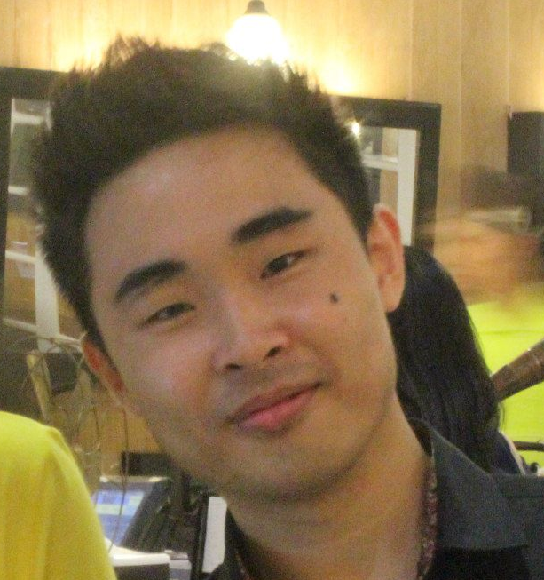

<!-- @@author A0138696L -->

# About Us

We are a team based in the [School of Computing, National University of Singapore](http://www.comp.nus.edu.sg).

## Project Team

#### [Peh Xian Bin, Eugene](https://github.com/eugenepeh)  
 
Role: Team lead    
* Components in charge of: [Logic](https://github.com/CS2103AUG2016-F09-C2/main/blob/master/docs/DeveloperGuide.md#logic-component) [Model](https://github.com/CS2103AUG2016-F09-C2/main/blob/master/docs/DeveloperGuide.md#model-component) [Integration]
* Aspects/tools in charge of: Testing, Compiling, GitHub
* Features implemented:
	* [add] (https://github.com/CS2103AUG2016-F09-C2/main/blob/master/docs/UserGuide.md#adding-a-task-add)
	* [edit] (https://github.com/CS2103AUG2016-F09-C2/main/blob/master/docs/UserGuide.md#edit-a-task--edit)
	* [mark] (https://github.com/CS2103AUG2016-F09-C2/main/blob/master/docs/UserGuide.md#mark-a-completed-task--mark)
	* [recur] (https://github.com/CS2103AUG2016-F09-C2/main/blob/master/docs/UserGuide.md#recur-a-task--recur)
	* [Indicate overdue and completed task] (Indicate overdue and completed task)
* Code written: [[functional code](A0148145E.md)][[test code](A0148145E.md)][[docs](A0148145E.md)]
* Other major contributions:
	* Did initial refactoring from AddressBook to MustDoList
	* Set up Travis, Coveralls and Reviewable (code-review)
	* Enhancing Undo command.

-----

#### [Tan Suan Zhi](https://github.com/e0003892)
 
Role: Project Manager    
* Components in charge of: [UI](https://github.com/CS2103AUG2016-F09-C2/main/blob/master/docs/DeveloperGuide.md#ui-component)
* Aspects/tools in charge of: Testing, Documentation
* Features implemented:
	* [undo](https://github.com/CS2103AUG2016-F09-C2/main/blob/master/docs/UserGuide.md#undo-a-previous-task--undo)
	* [up down arrow](https://github.com/CS2103AUG2016-F09-C2/main/blob/master/docs/UserGuide.md#reuse-previous-command--up-down-arrow)
* Code written: [[functional code](A0140007B.md)][[test code](A0140007B.md)][[docs](A0140007B.md)]	
* Other major contributions:
	* Implemented Undo command initially
	* In-charge of maintaining the documentation
	* Managing the team progress.

-----

#### [Chua Jun Wen](https://github.com/JunWen991) 
 
Role: Editor    
* Components in charge of: [Storage](https://github.com/CS2103AUG2016-F09-C2/main/blob/master/docs/DeveloperGuide.md#storage-component)
* Aspects/tools in charge of: Testing, Documentation, Code quality
* Features implemented:
	* [find](https://github.com/CS2103AUG2016-F09-C2/main/blob/master/docs/UserGuide.md#find-a-task--find)
	* [setpath](https://github.com/CS2103AUG2016-F09-C2/main/blob/master/docs/UserGuide.md#select-a-task--setpath)
	* [Unmark] ()
* Code written: [[functional code](A0138969L.md)][[test code](A0138969L.md)][[docs](A0138969L.md)]	
* Other major contributions:
	*
	*
	
-----

## Mentor

#### [Jeffry Hartanto](https://github.com/jeffryhartanto)
 
Role: Project Advisor   
 
 -----

# Contributors

We welcome contributions. See [Contact Us](ContactUs.md) page for more info.

* [Akshay Narayan](https://github.com/se-edu/addressbook-level4/pulls?q=is%3Apr+author%3Aokkhoy)
* [Sam Yong](https://github.com/se-edu/addressbook-level4/pulls?q=is%3Apr+author%3Amauris)