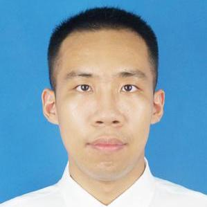

# About Us

We are a team based in the [School of Computing, National University of Singapore](http://www.comp.nus.edu.sg).

## Project Team

#### [Peh Xian Bin, Eugene](https://github.com/eugenepeh)  
 
Role: Integration, Team lead    
Responsibilities: Logic

-----

#### [Tan Suan Zhi](https://github.com/e0003892)
 
Role: Documentation    
Responsibilities: UI

-----

#### [Chua Jun Wen](https://github.com/JunWen991) 
 
Role: Testing    
Responsibilities: Model

-----

#### [YUAN WENYI](https://github.com/ywy13250)
 
Role: Code quality    
Responsibilities: Storage

-----

## Mentor

#### [Jeffry Hartanto](https://github.com/jeffryhartanto)
 
Role: Project Advisor   
 
 -----

# Contributors

We welcome contributions. See [Contact Us](ContactUs.md) page for more info.

* [Akshay Narayan](https://github.com/se-edu/addressbook-level4/pulls?q=is%3Apr+author%3Aokkhoy)
* [Sam Yong](https://github.com/se-edu/addressbook-level4/pulls?q=is%3Apr+author%3Amauris)