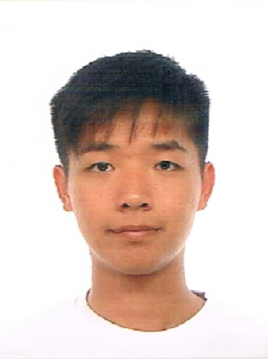

# About Us

We are a team based in the School of Computing, National University of Singapore (NUS). We are working on a Task List Application aimed to allow users to record tasks need to be done and prioritise accordingly. Our work can be found on  [CS2103AUG2016-F09-C1] (https://github.com/CS2103AUG2016-F09-C1).

## Project Team

#### [Jeffry Hartanto](https://github.com/jeffryhartanto)  
 
Role: Project Advisor  

#### [Bernard Tan Ke Xuan](https://github.com/bernardtankx)  
 
Role: Developer  
Responsibilities: Team Lead, Integration
Area of Focus: Logic

-----

#### [Toni Miharja](https://github.com/tmiharja)
 
Role: Developer    
Responsibilities: Code Quality
Area of Focus: Model

-----

#### [Chua Woo Hian](https://github.com/woohian)
 
Role: Developer    
Responsibilities: Documentation, Scheduling
Area of Focus: UI

-----

#### [Chu Ying Yu](https://github.com/azoic0)
 
Role: Developer    
Responsibilities: Testing, Deadlines
Area of Focus: Storage
