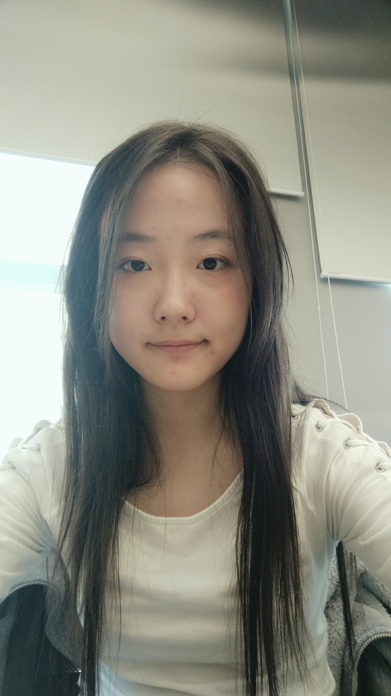
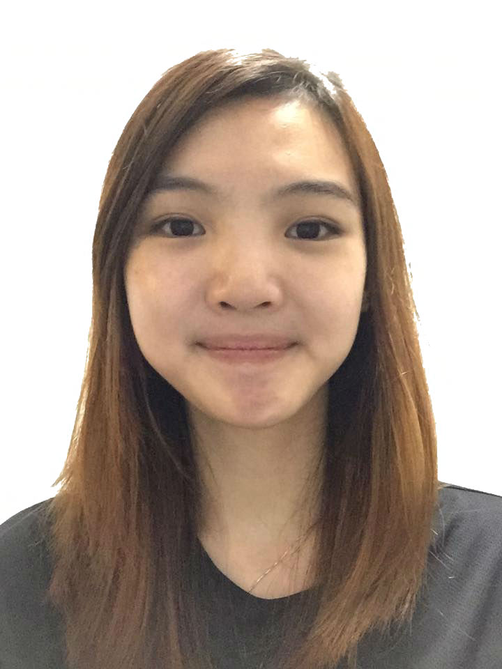

# About Us

We are a team based in the [School of Computing, National University of Singapore](http://www.comp.nus.edu.sg).

## Project Team

#### [Damith C. Rajapakse](http://www.comp.nus.edu.sg/~damithch)  
 
**Role**: Project Advisor

-----

#### Chan Jun Wei
 
**Role**: Project Mentor  

-----

#### [Shi Xiyue](https://github.com/shixiyue)
 
Role: Developer    
Responsibilities:  
* ‘Storage' && 'Model' Component.
* Code Quality I/c: Looks after code quality, ensures adherence to coding standards, etc.
* Scheduling and tracking I/c: In charge of defining, assigning, and tracking project tasks.

-----

#### [Li Xiaowei](https://github.com/LiXiaoooowei)
 
Role: Developer    
Responsibilities:  
* Logic Component and Common Component I/c: ensure that the codes adhere to coding standards, and update documentation of any changes in the two components 
* Testing I/c: Ensures the testing of the project is done properly and on time.

-----

#### [Angeline Neoh Xing Yii](https://github.com/angellineeee)
 
 Role: Developer    
 Responsibilities: 
* 'UI' Component.
* Documentation I/c: Responsible for the quality of various project documents.
* Integration I/c: In charge of versioning of the code, maintaining the code repository, integrating various parts of the software to create a whole.
