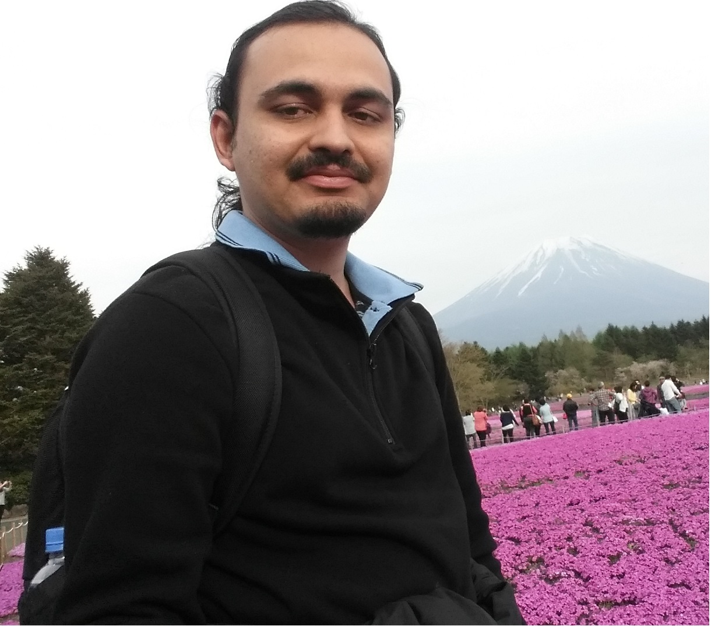
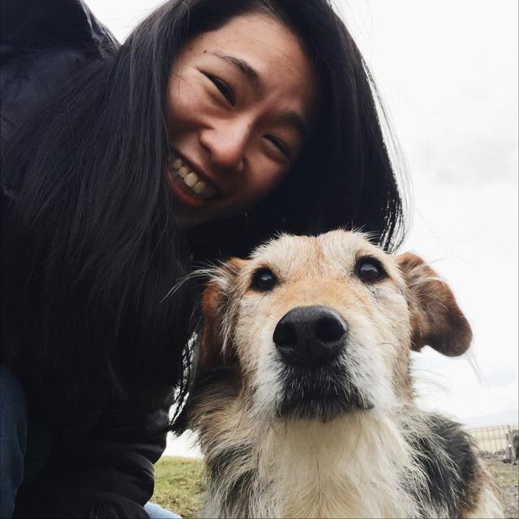
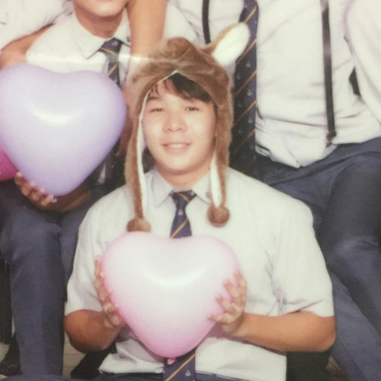
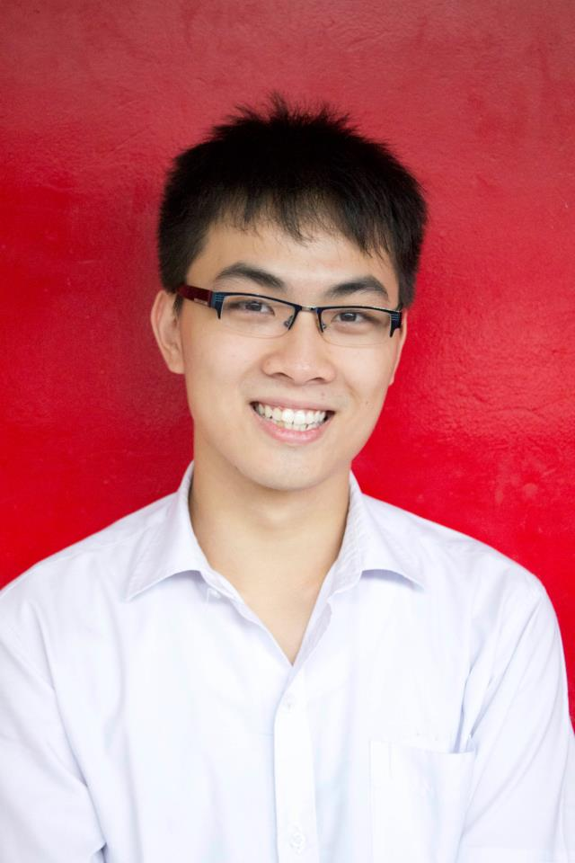

# About Us

We are a project team for the module CS2103 - Software Engineering from the [School of Computing, National University of Singapore](http://www.comp.nus.edu.sg).

## Project Team

#### [Muthu Kumar Chandrasekaran](http://wing.comp.nus.edu.sg/~cmkumar)
 

**Role**: Project Advisor

-----

#### CARA LEONG SU-YI
 

**Responsibilities**: UI

-----

#### DARREN WEE ZHE YU
 

**Responsibilities**: Storage

-----

#### LE MINH DUC
 

**Responsibilities**: Model

-----

#### YUAN YUCHUAN
 

**Responsibilities**: Logic

-----

