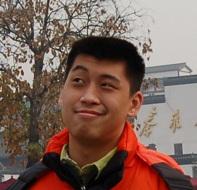
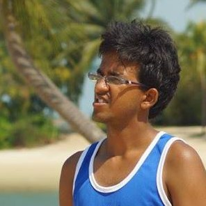
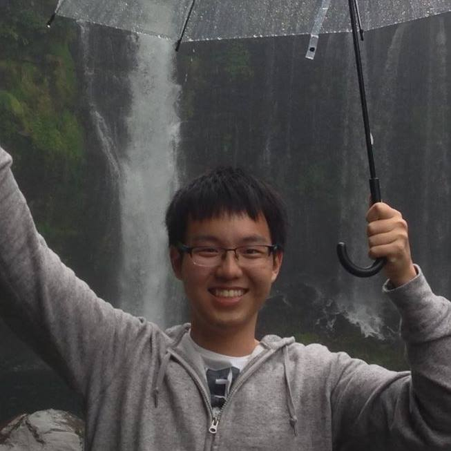
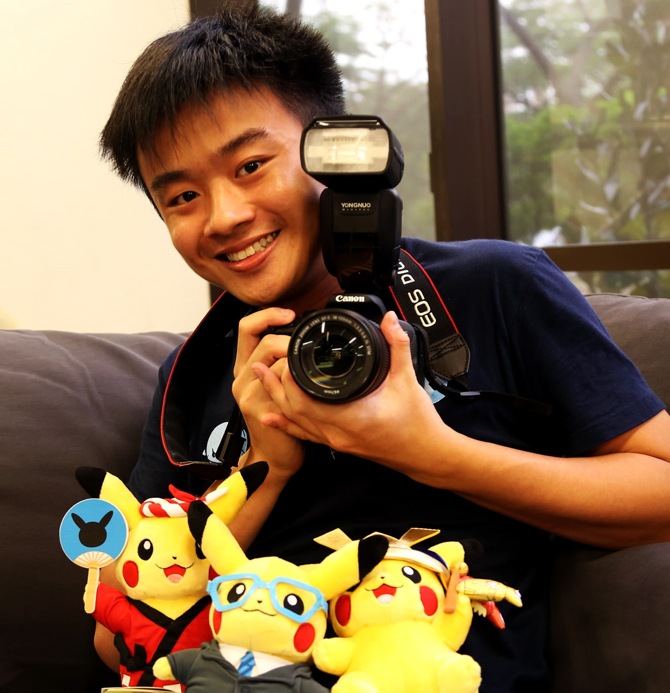

# About Us

We are a team based in the [School of Computing, National University of Singapore](http://www.comp.nus.edu.sg).

## Project Team

#### [Damith C. Rajapakse](http://www.comp.nus.edu.sg/~damithch)  
 
**Role**: CS2103T Tutor, Project Advisor

-----

#### [Zhang Yi Jiang](https://github.com/ZhangYiJiang)
 
**Role**: Lead Developer  
**Responsibilities**: Parser, Logic and Integration

-----

#### [Govind Venugopalan](https://github.com/cricketer94)
 
**Role**: Backend Developer  
**Responsibilities**: Logic and Documentation

-----

#### [Li Kai](https://github.com/li-kai) 
 
**Role**: Backend Developer  
**Responsibilities**: Database and Model Design

-----

#### [Wang Xien Dong](http://github.com/xdrawks)
 
**Role**: Frontend Developer  
**Responsibilities**: User Interface

