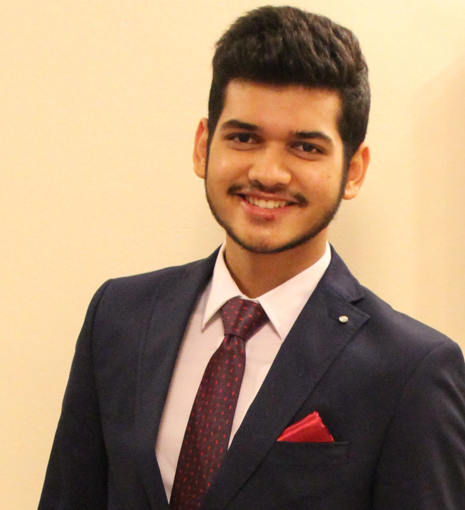

<!-- @@author A0147619W -->
# About Us

We are a team of four 2nd Year Computer Engineering students based in the [School of Computing, National University of Singapore](http://www.comp.nus.edu.sg).

## Project Team

#### [Shailesh Nahata](https://github.com/nahata-shailesh)  
 
**Role**: Developer  
**Responsibilities**: Parsing

-----

#### [Teh Chee Yeo](https://github.com/cheo1994)  
 
**Role**: Developer    
**Responsibilities**: Logic

-----

#### [Tan Jun Hao](https://github.com/e0003083)   
 
**Role**: Developer    
**Responsibilities**: Storage

-----

#### [Qiang Yu](https://github.com/Hastyrush)  
 
**Role**: Developer    
**Responsibilities**: UI

-----

## Project Mentor
 
#### [Nirandika Wanigasekara](https://github.com/nirandiw)  

-----
