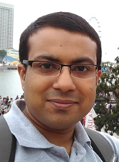
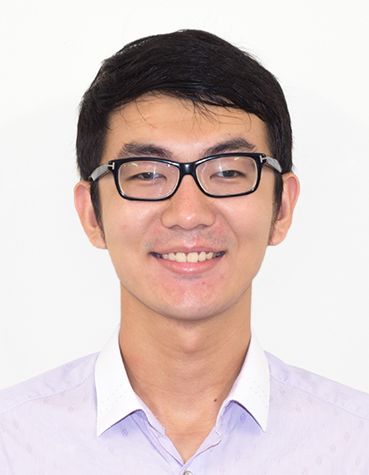
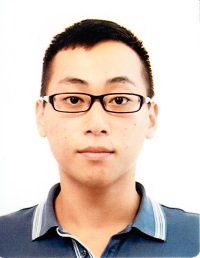
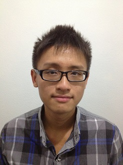

# About Us

We are team T13-C2 for the module CS2103 based in the [School of Computing, National University of Singapore]

## Project Mentor

#### [Akshay Narayan]
 

## Project Team

#### [Zhang Zongyi](http://github.com/zongyizzy)
 
* Components in charge of: [Storage] (https://github.com/se-edu/addressbook-level4/blob/master/docs/DeveloperGuide.md#storage-component)
* Aspects/tools in charge of: Git
* Features Implemented
..*[ListCommand] (https://github.com/CS2103AUG2016-T13-C2/main/blob/master/docs/UserGuide.md#list-activities--list)
..*[FindByTagCommand] (https://github.com/CS2103AUG2016-T13-C2/main/blob/master/docs/UserGuide.md#find-by-tag--findtag)
..*[AddCommand] (https://github.com/CS2103AUG2016-T13-C2/main/blob/master/docs/UserGuide.md#adding-an-activity--add)
* Code Written: []
* Other major contributions:
..* 
  
Responsibilities: Code Quality/Deliverables/UI

-----

#### [Aloisius Stephen](https://github.com/aloisiusStephen)
  
* Components in charge of: []
* Aspects/tools in charge of: Git
* Features Implemented
..* [Undo commands](https://github.com/CS2103AUG2016-T13-C2/main/blob/master/docs/UserGuide.md#undoing-an-action--undo)
..* [Mark completion](https://github.com/CS2103AUG2016-T13-C2/main/blob/master/docs/UserGuide.md#marking-an-activity-as-done-done)
* Code Written:[functional code][test code][docs]
* Other major contributions:
..* 
-----

#### [Kevin Ong](https://github.com/Kevin-Ong)
 
* Components in charge of:  [Logic](https://github.com/se-edu/addressbook-level4/blob/master/docs/DeveloperGuide.md#logic-component)
* Aspects/tools in charge of: 
* Features Implemented
..* [Edit commands](https://github.com/CS2103AUG2016-T13-C2/main/blob/master/docs/UserGuide.md#editing-an-activity--edit)
* Code Written:[functional code][test code][docs]
* Other major contributions:
..* [Specifying save location]
..* [Implemented floating activities]

-----

#### [Hong Bangwu](https://github.com/ndt93)
  
* Components in charge of: 
* Aspects/tools in charge of: 
* Features Implemented
..*
* Code Written:
* Other major contributions:
..* 
-----