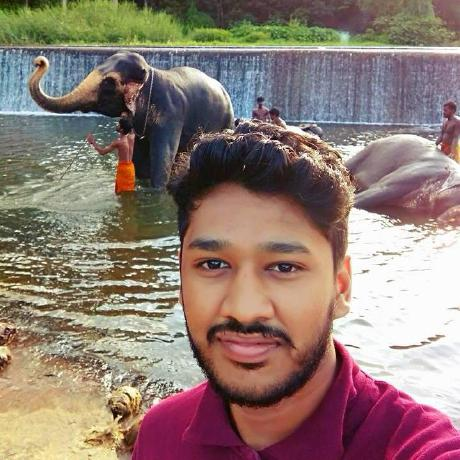
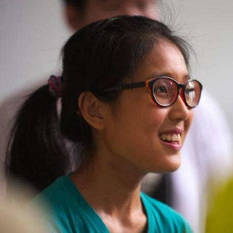
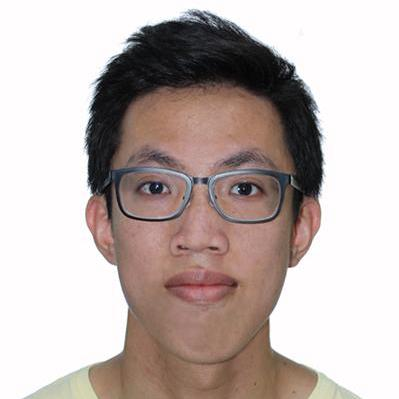

# About Us

We are a team based in the [School of Computing, National University of Singapore](http://www.comp.nus.edu.sg).

## Project Team

#### [Damith C. Rajapakse](http://www.comp.nus.edu.sg/~damithch)  
 
**Role**: Project Advisor

-----

#### [Abdul Rahman](https://github.com/arshrahman)
 
Role: Developer    
Responsibilities: Logic, Code Quality

-----

#### [Clara Tan](https://github.com/hotchocolatemarshmallow) 
 
Role: Developer    
Responsibilities: Storage, Documentation

-----

#### [Chia Zhe Min](https://github.com/zhems)
 
Role: Developer    
Responsibilities: UI, Testing
 -----

# Contributors

We welcome contributions. See [Contact Us](ContactUs.md) page for more info.

* [Akshay Narayan](https://github.com/se-edu/addressbook-level4/pulls?q=is%3Apr+author%3Aokkhoy)
* [Sam Yong](https://github.com/se-edu/addressbook-level4/pulls?q=is%3Apr+author%3Amauris)