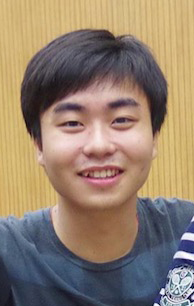

# About Us

We are a team based in the [School of Computing, National University of Singapore](http://www.comp.nus.edu.sg).

## Project Team

#### [Brandon Yeo Xiang Guang](https://github.com/brandonyeoxg)  
 
**Role**: Project Leader
* Aspects/tools in charge of: Leader
* Features implemented:
    * [Add recurring](https://github.com/CS2103AUG2016-W09-C2/main/blob/master/docs/UserGuide.md#adding-a-floating-task-add)
* Code written: [[functional code](../collated/main/A0135782Y.md)][[testcode](../collated/test/A0135782Y.md)][[docs](../collated/docs/A0135782Y.md)]
* Other major contributions:
    * Set up Travis and EclEmma
    
-----

#### [Duan Yi Chen](http://github.com/Yichen-D)
 
Role: Developer    
* Aspects/tools in charge of: Testing
* Features implemented:
    * [Done](https://github.com/CS2103AUG2016-W09-C2/main/blob/master/docs/UserGuide.md#archive-completed-tasks--done)
    * [Block](https://github.com/CS2103AUG2016-W09-C2/main/blob/master/docs/UserGuide.md#block-out-timeslot--block)
    * [Undo](https://github.com/CS2103AUG2016-W09-C2/main/blob/master/docs/UserGuide.md#undo-tasks--undo)
    * [Redo](https://github.com/CS2103AUG2016-W09-C2/main/blob/master/docs/UserGuide.md#redo-tasks--redo)
    * [Cd](https://github.com/CS2103AUG2016-W09-C2/main/blob/master/docs/UserGuide.md#change-directory-cd)
* Code written: [[functional code](../collated/main/A0147967J.md)][[testcode](../collated/test/A0147967J.md)][[docs](../collated/docs/A0147967J.md)]

-----

#### [Ong Yen Khai Anton](http://github.com/yijinl) 
 
Role: Developer    
* Aspects/tools in charge of: Documentation
* Features implemented:
* Code written: [[functional code](../collated/main/A0135784W.md)][[docs](../collated/docs/A0135784W.md)]

-----

#### [Yang Zhuo Han](http://github.com/m133225)
Role: Developer    
 
* Aspects/tools in charge of: Code Quality & Integration
* Features implemented:
    * [Edit](https://github.com/CS2103AUG2016-W09-C2/main/blob/master/docs/UserGuide.md#edit-tasks--edit)
    * [Find](https://github.com/CS2103AUG2016-W09-C2/main/blob/master/docs/UserGuide.md#find-tasks--find)
* Code written: [[functional code](../collated/main/A0147995H.md)][[testcode](../collated/test/A0147995H.md)][[docs](../collated/docs/A0147995H.md)]

-----
