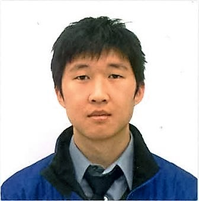
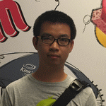

# About Us

We are a team in the [CS 2103 Class](http://www.comp.nus.edu.sg/~cs2103/AY1617S1/).

## Project Team

#### [Nishant Budhdev](https://github.com/nishantbudhdev)  
 
**Role**: Project Mentor

-----

#### [Murray Chen](https://github.com/mchen14)  
 
Role: Team Lead, Developer  
Responsibilities: Code Quality

-----

#### [Zihua Huang](https://github.com/JamesHuangUC)
 
Role: Developer    
Responsibilities: Integration, Git Expert, Scheduling and Tracking

-----

#### [Yaquan Wang](https://github.com/A0116137M) 
Role: Developer    
Responsibilities: Documentation, Testing, Deliverables and Deadlines
 
 -----

# Contributors

We welcome contributions. See [Contact Us](ContactUs.md) page for more info.
