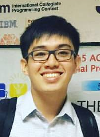
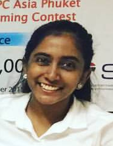
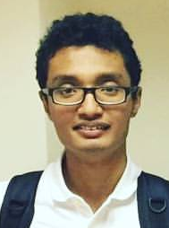
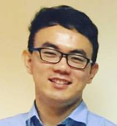
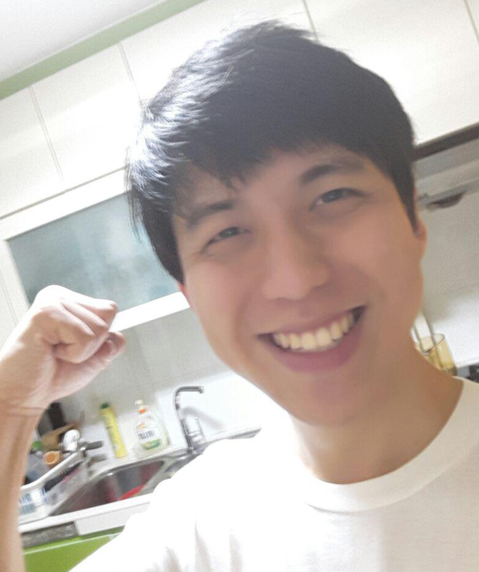

# About Us

We are a team based in the [School of Computing, National University of Singapore](http://www.comp.nus.edu.sg).
Our project is a Task Manager for Jim.

## Project Team

#### [Ong Li-Jen](https://github.com/lijen1994)  
 
Role: Project Lead    
Responsibilities: Code Quality

-----

#### [Anniya Baskaran](https://github.com/AnniyaB)
 
Role: Developer    
Responsibilities: Integration

-----

#### [Muhammad Arif Bin Syed Nasser](https://github.com/Halo3fanz)
 
Role: Developer    
Responsibilities: Documentation

-----

#### [Zhang Hao](https://github.com/e0008233)
 
Role: Developer    
Responsibilities: Dev Ops

-----

## Project Mentor

#### [Pierce Anderson Fu]()
 
Phase C tutor

-----
