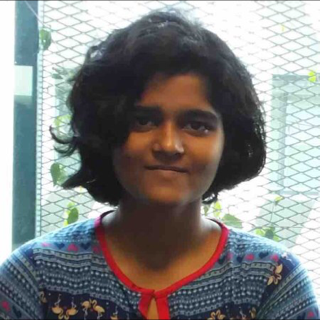
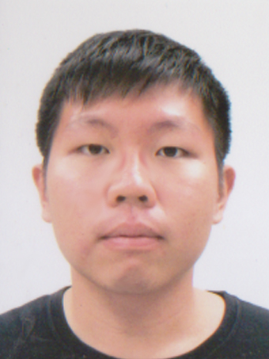

# About Us

We are a team based in the [School of Computing, National University of Singapore](http://www.comp.nus.edu.sg).

## Project Team

#### [Ravi Shwetha](http://github.com/ravishwetha) 
 

* Components in charge of: [Storage and Testing](https://github.com/se-edu/addressbook-level4/blob/master/docs/DeveloperGuide.md#storage-component)
* Aspects/tools in charge of: Testing, Git
* Features implemented:
   * [Basic undo and multiple undo](https://github.com/se-edu/addressbook-level4/blob/master/docs/UserGuide.md#listing-all-persons--list)
   * [Edit task](https://github.com/se-edu/addressbook-level4/blob/master/docs/UserGuide.md#deleting-a-person--delete)
   * [Find searches for exact keywords first](https://github.com/se-edu/addressbook-level4/blob/master/docs/UserGuide.md#deleting-a-person--delete)
   * [Natural language processing for dates using Natty API](https://github.com/se-edu/addressbook-level4/blob/master/docs/UserGuide.md#deleting-a-person--delete)
* Code written: [[functional code](A0146130W.md)][[test code](A0146130W.md)][[docs](A0146130W.md)]
* Other major contributions:
  * Did the initial refactoring from Person model to Task model [[#133](https://github.com/se-edu/addressbook-level4/pull/152) ]
  * Set up Coveralls and Collate
  * Change browser to search task location on google maps
  
-----

#### [Tan Shao Yun](http://github.com/shaocloud)
 
Role: Developer    
* Components in charge of: [UI, Design](https://github.com/CS2103AUG2016-F10-C3/main/blob/master/docs/DeveloperGuide.md#design)
* Features implemented:	
	* [Reordered UI](https://github.com/CS2103AUG2016-F10-C3/main/tree/master/src/main/resources/view)
	* [UML Design](https://github.com/CS2103AUG2016-F10-C3/main/blob/master/docs/DeveloperGuide.md)
* Other major contributions:
	* [Designed Screenshots](https://github.com/CS2103AUG2016-F10-C3/main/blob/master/docs/images/Ui.jpg)
	* [Designed icon](https://github.com/CS2103AUG2016-F10-C3/main/tree/master/src/main/resources/tary.png)

-----

#### [Voon Soo Yin](http://github.com/tessav) 
 
 
* Components in charge of: [Logic](https://github.com/se-edu/addressbook-level4/blob/master/docs/DeveloperGuide.md#logic-component)
* Aspects/tools in charge of: Documentation, Travis
* Features implemented:
   * [Add task with flexibility in command format]()
   * [Add floating task and event task]()
   * [Find task by each field type]()
   * [Mark task as done]()
   * [Separate listing of tasks that are done/not done]()
* Code written: [[functional code](A0130677A.md)][[test code](A0130677A.md)][[docs](A0130677A.md)]
* Other major contributions:
  * Command format validation & regex
  * Set up Travis
  * Complete user guide
 
------

# Acknowledgements

#### [Chan Jun Wei](http://github.com/chanjunweimy) 
 
 Role: Module Tutor and Project Supervisor    

 -----
 
Code modified from : https://github.com/nus-cs2103-AY1617S1/addressbook-level4
