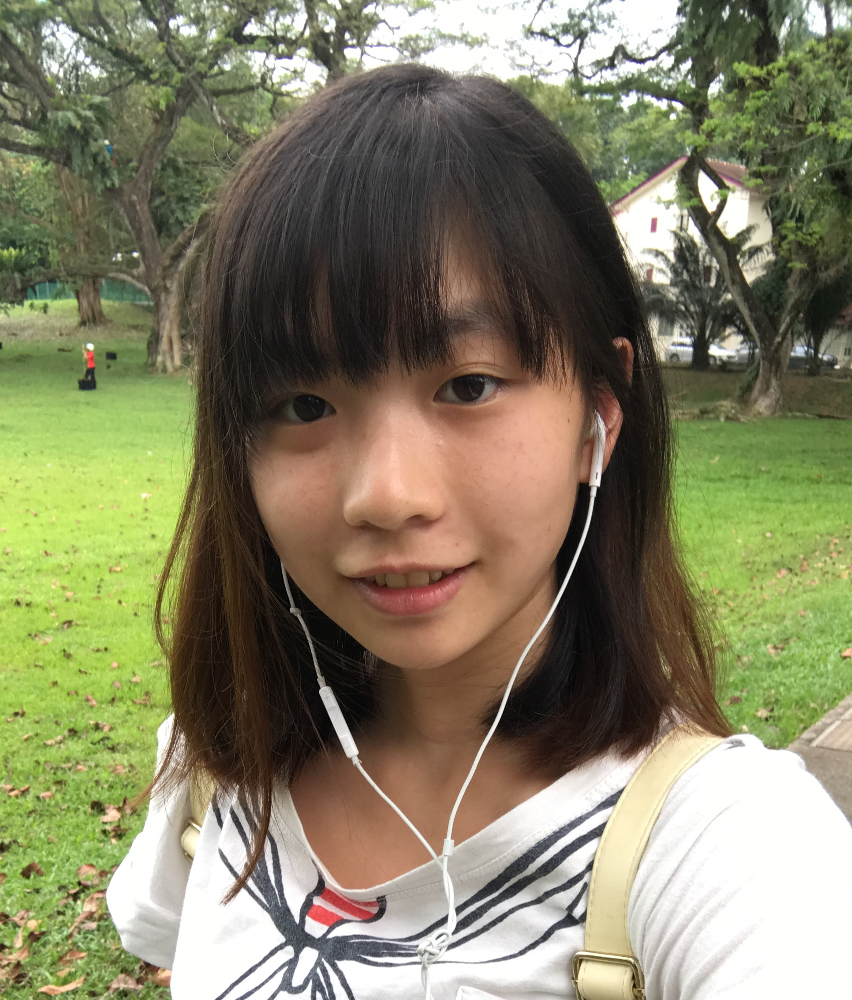
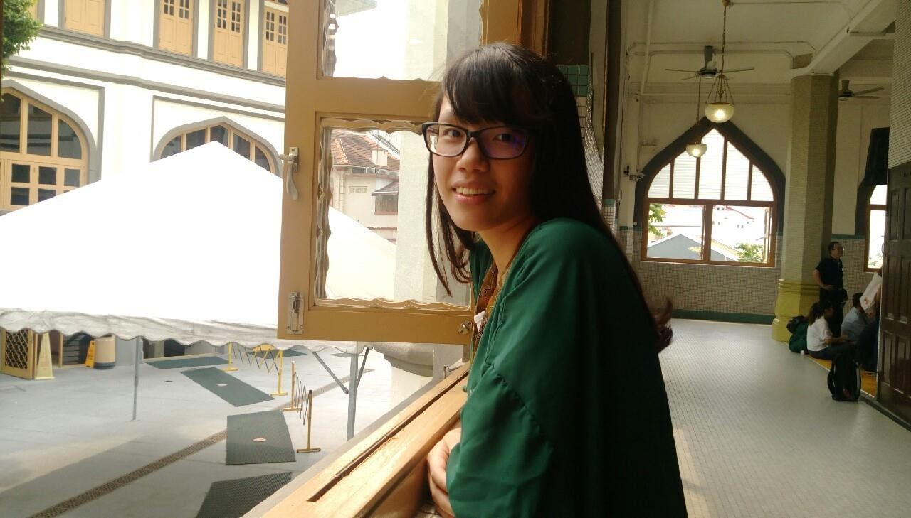

# About Us

We are a group of students in the [School of Computing, National University of Singapore](http://www.comp.nus.edu.sg).

## Project Team

#### [Ang Shi Ya](https://github.com/AngShiYa)  
 
* Components in charge of: [Model] (https://github.com/CS2103AUG2016-T15-C3/main/blob/master/docs/DeveloperGuide.md#model-component)
* Aspects/tools in charge of: Testing, Git
* Features implemented: 
  * [Add task] (https://github.com/CS2103AUG2016-T15-C3/main/blob/master/docs/UserGuide.md#adding-a-task--add)
  * [Mark task as done] (https://github.com/CS2103AUG2016-T15-C3/main/blob/master/docs/UserGuide.md#marking-task-as-done--done)
  * [Delete task] (https://github.com/CS2103AUG2016-T15-C3/main/blob/master/docs/UserGuide.md#deleting-a-task--delete)
  * [Sort task list displayed] (https://github.com/CS2103AUG2016-T15-C3/main/pull/75)
* Other major contributions:
  * Did the initial refactoring from AddressBook to Task!t [[#1](https://github.com/CS2103AUG2016-T15-C3/main/pull/2) ]
  * Set up Travis, Coveralls and Codacy

-----

#### [Wu Cheuk Kwan Carina](https://github.com/carinackwu)  
 
* Components in charge of: [Logic] (https://github.com/CS2103AUG2016-T15-C3/main/blob/master/docs/DeveloperGuide.md#logic-component)
* Aspects/tools in charge of: Team Lead
* Features implemented: 
  * [List tasks] (https://github.com/CS2103AUG2016-T15-C3/main/blob/master/docs/UserGuide.md#listing-all-tasks--list)
  * [Find task] (https://github.com/CS2103AUG2016-T15-C3/main/blob/master/docs/UserGuide.md#finding-all-tasks-containing-keyword-in-the-name--find)
  * [Undo operation] (https://github.com/CS2103AUG2016-T15-C3/main/blob/master/docs/UserGuide.md#undoing-last-action-performed--undo)

-----

#### [Huang Tsai Ti](https://github.com/tyrahuang)  
 
Role: Code quality, Developer    
Responsibilities: Storage

-----

#### [Lai Yingchen](https://github.com/yingchen0505)  
 
Role: Integration, Developer    
Responsibilities: UI
