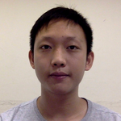
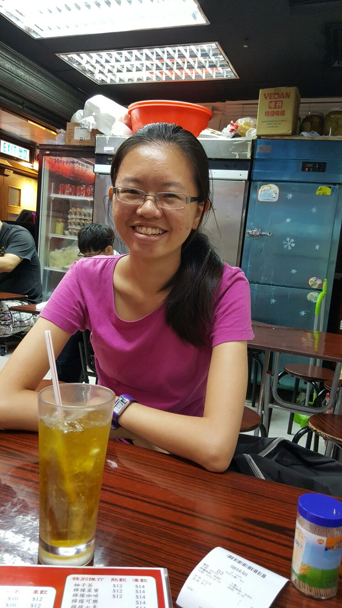

//@@author A0139024M
# About Us

We are a team based in the [School of Computing, National University of Singapore](http://www.comp.nus.edu.sg).

## Project Team

#### [Tan Yu Peng](http://github.com/GitMeGet)
 
Role: Developer    
Responsibilities:   
- Deliverables and deadlines: Ensure project deliverables are done on time and in the right format. 

-----

#### [Tan Hong Yu](http://github.com/hongyuhy)
 
Role: Developer    
Responsibilities:   
- Testing: Ensures the testing of the project is done properly and on time. 

-----

#### [Tan Zhi Jie](http://github.com/zhijietan94)
 
Role: Developer    
Responsibilities:  
- Code quality: Looks after code quality, ensures adherence to coding standards, etc. 
- Integration: In charge of versioning of the code, maintaining the code repository, integrating various parts of the software to create a whole. 

-----

#### [Jeremy Wong](http://github.com/snowfeline)
 
Role: Developer    
Responsibilities:  
- Documentation: Responsible for the quality of various project documents. 
 
-----

## Mentor
####Chua Ka Yi Ong
 
Role: Project Mentor  

----
