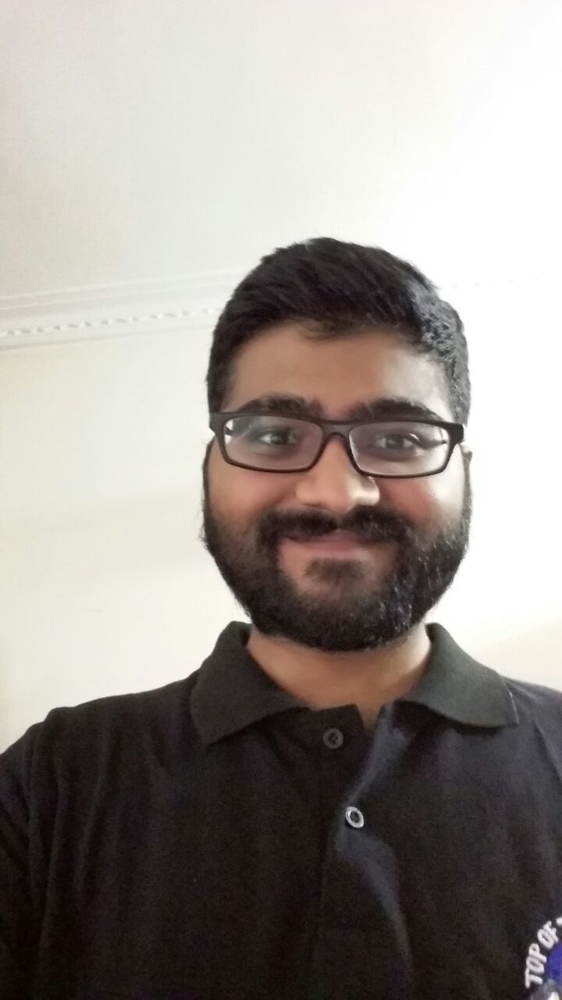
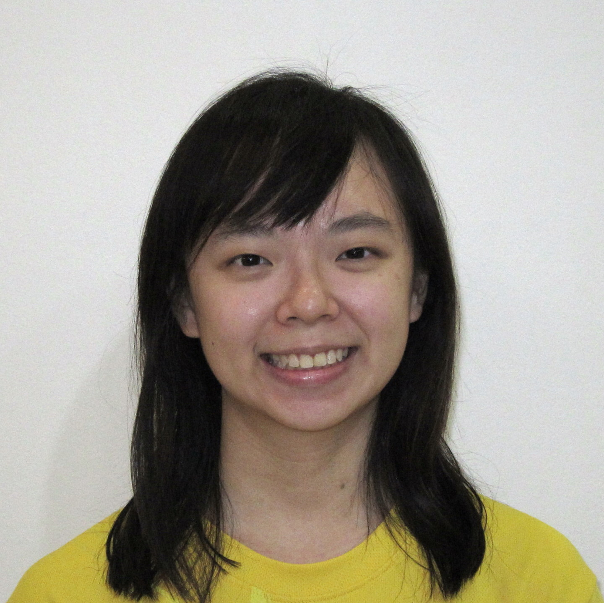
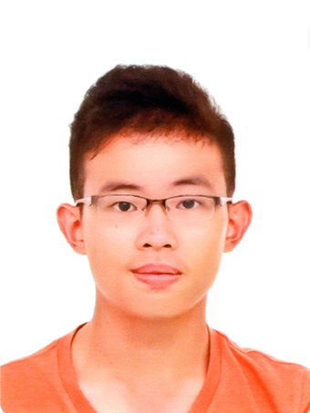

# About Us

We are a team based in the [School of Computing, National University of Singapore](http://www.comp.nus.edu.sg).

## Project Team

#### [Sriram Sami](http://github.com/frizensami)
   
**Role**: Leader  
**Component in charge of:** Model  
**Aspects/Tools in charge of:** GUI Tests, Travis CI, Git  

**Features Implemented:**
- Autocomplete
- Up/Down Commands History
- Pin/Unpin
- Set Storage Location

**Code written:**
 * [[functional code](../collated/main/A0138978E.md)]
 * [[test code](../collated/test/A0138978E.md)]
 * [[docs](../collated/docs/A0138978E.md)]

-----

#### [Nikhil Suresh](http://github.com/kneekill)
  
**Role**: Developer  
**Component in charge of:** UI  
**Aspects/Tools in charge of:** UI Design (SceneBuilder), Documentation  

**Features Implemented:**

- Help Panel
- Labels for list state
- Alias Window
- List command

**Code written:**
 * [[functional code](../collated/main/A0139708W.md)]
 * [[test code](../collated/test/A0139708W.md)]
 * [[docs](../collated/docs/A0139708W.md)]

-----

#### [Chew Zi Ling](http://github.com/ChewZL)
  
**Role**: Developer  
**Component in charge of:** Storage  
**Aspects/Tools in charge of:** Non-GUI tests, Coveralls  

**Features Implemented:**

- Alias/Unalias commands
- Alias storage
- Substring-supported find command
- Complete/Uncomplete commands

**Code written:**
 * [[functional code](../collated/main/A0143107U.md)]
 * [[test code](../collated/test/A0143107U.md)]
 * [[docs](../collated/docs/A0143107U.md)]

 -----

#### [Tang Yew Siang](http://github.com/yewsiang)
  
 Role: Developer  
**Component in charge of:** Logic  
**Aspects/Tools in charge of:** Acceptance Testing, Gradle  

**Features Implemented:**

- Add command
- Update command
- Date/Time parsing
- Floating/Event/Deadline Task implementation

**Code written:**
 * [[functional code](../collated/main/A0139817U.md)]
 * [[test code](../collated/test/A0139817U.md)]
 * [[docs](../collated/docs/A0139817U.md)]

 -----

## Project Mentor
#### [Alvian Prasetya](http://github.com/AlvianPrasetya)
 

# Contributors

We welcome contributions. See [Contact Us](ContactUs.md) page for more info.

* [Akshay Narayan](https://github.com/se-edu/addressbook-level4/pulls?q=is%3Apr+author%3Aokkhoy)
* [Sam Yong](https://github.com/se-edu/addressbook-level4/pulls?q=is%3Apr+author%3Amauris)
