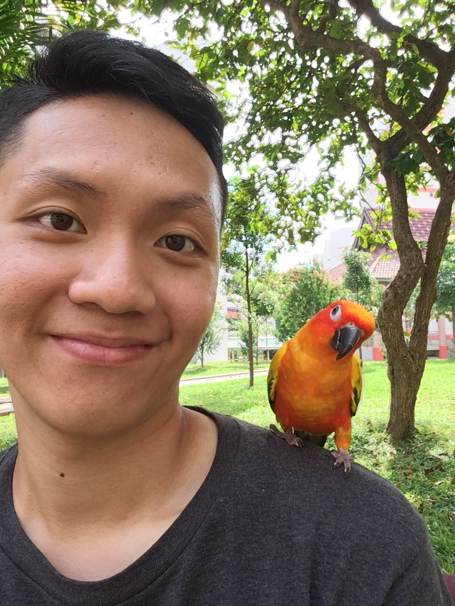
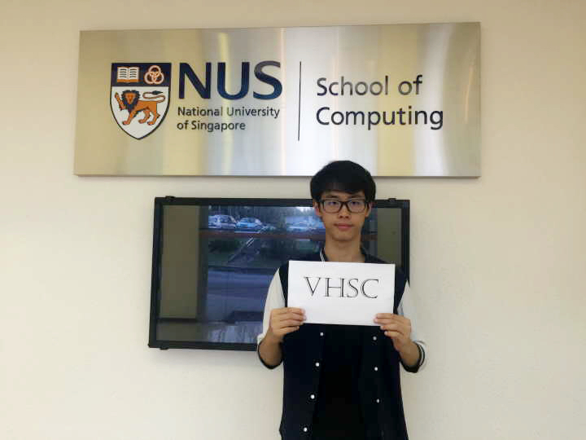

# About Us

We are a team based in the [School of Computing, National University of Singapore](http://www.comp.nus.edu.sg).

## Project Team

#### [Gary Goh](https://github.com/garygjy)
 
 Role: Developer  
 Responsibilities: Data

-----

#### [Nathanael Chan](https://github.com/nat1994)
 
 Role: Developer  
 Responsibility: Logic
 
-----

#### [Gauri Joshi](https://github.com/gaurzzz)
 
 Role: Developer  
 Responsibility: Storage
 
-----

#### [Lu Hua]
 
 Role: Developer  
 Responsibility: UI
 
-----

# Contributors

We welcome contributions. See [Contact Us](ContactUs.md) page for more info.

* [Akshay Narayan](https://github.com/se-edu/addressbook-level4/pulls?q=is%3Apr+author%3Aokkhoy)
* [Sam Yong](https://github.com/se-edu/addressbook-level4/pulls?q=is%3Apr+author%3Amauris)
