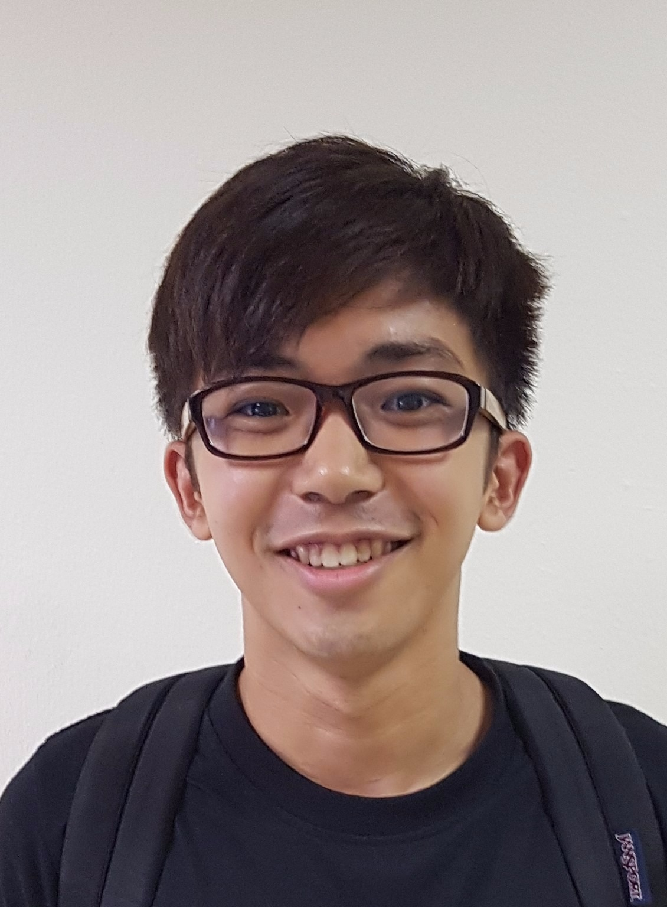
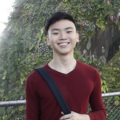
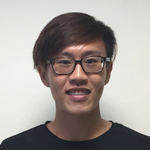

# About Us

We are a team of students from the [School of Computing, National University of Singapore](http://www.comp.nus.edu.sg).

## Project Team

#### [Low Jian Sheng](https://github.com/lowjiansheng)  
 
**Role**: Developer  
Responsibilities: Product Functionality

-----

#### [Brehmer Chan Xi Quan](https://github.com/BrehmerChan)
 
Role: Developer    
Responsibilities: Logic/Model

-----

#### [Low Jun Cheng Marx](https://github.com/marxlow)
 
Role: Developer    
Responsibilities: Testing/Activity Model

-----

#### [Seow Wei Jie](https://github.com/weijieseow)
 
Role: Developer    
Responsibilities: UI / UX

-----

#### Phang Chun Rong
 
Role: Project Mentor    

-----
