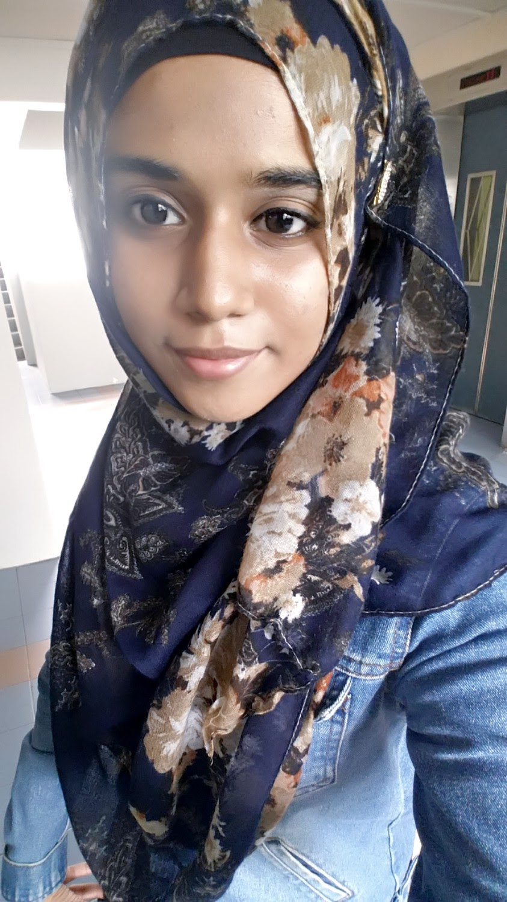
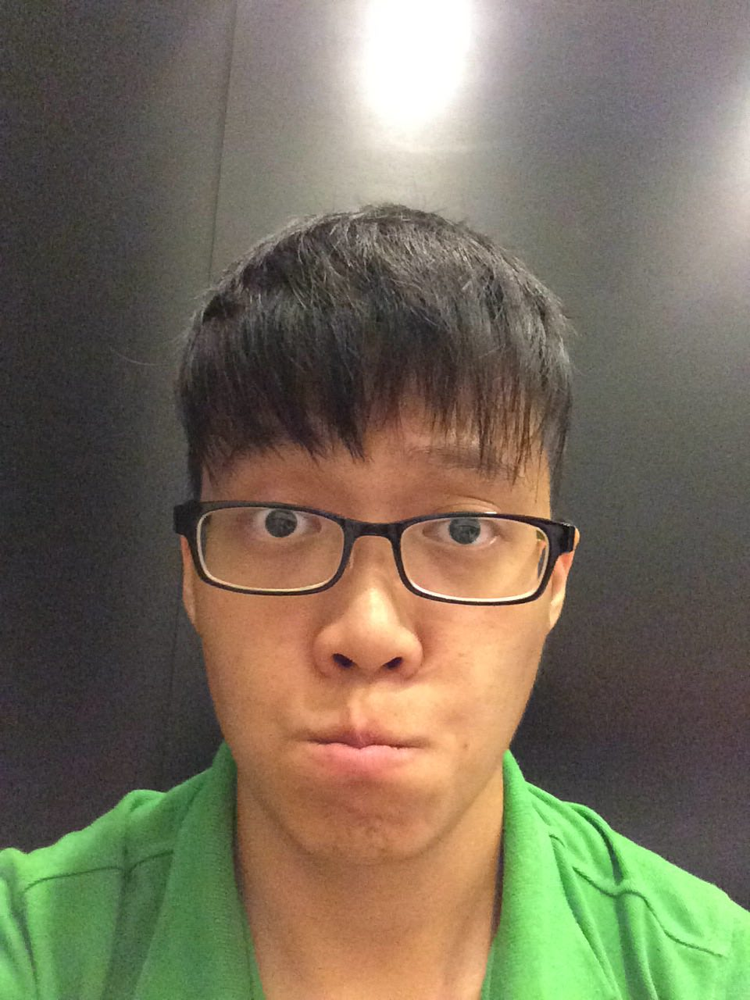

# About Us

We are a team F11-C2, a CS2103 team based in [School of Computing, National University of Singapore](http://www.comp.nus.edu.sg).

## Project Team

#### [Chiang Weng Kiat](http://github.com/wengkiat)  
 
**Role**: Team Lead, Project Coordinator
Responsibilities: 
* Responsible for overall project coordination.
* Documentation
* Responsible for the quality of various project documents

-----

#### [Justin Ng](http://github.com/njyjn)
 
Role: Integration Lead    
Responsibilities: Integration
* In charge of versioning of the code, maintaining the code repository, integrating various parts of the software to create a whole.
* Scheduling and tracking: In charge of defining, assigning, and tracking project tasks.
* [Git/Eclipse] expert: e.g. Eclipse expert, Git expert, etc. Helps other team member with matters related to the specific tool.
 
-----
#### [Rahumathmarini](http://github.com/marinirah)
 
Role: Quality Lead    
Responsibilities:
* Looks after code quality, ensures adherence to coding standards, etc.
* Deliverables and deadlines: Ensure project deliverables are done on time and in the right format.

-----

#### [Lim Hong Wei](http://github.com/imhongw)
 
Role: Chief Designer, Lead Tester    
Responsibilities:
* Takes care of the UI, UX and design of the project.
* Ensures the testing of the project is done properly (all passing), extensively, and on time.

-----

#### [Bay Chuan Wei Candiie](http://github.com/Candiie)
 
Role: Project Mentor    
Responsibilities:
* Provides guidance for the project.

# Contributors

We welcome contributions. See [Contact Us](ContactUs.md) page for more info.
