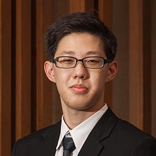

# About Us

We are a team based in the [School of Computing, National University of Singapore](http://www.comp.nus.edu.sg).

## Project Team

### [Damith C.Rajapakse](http://www.comp.nus.edu.sg/~damithch)  
 
**Role**: Project Mentor

-----

#### [Kenneth Tan Xin You](https://github.com/kennethtxytqw) 
 
* Components in charge of: [Model](https://github.com/CS2103AUG2016-W10-C3/main/blob/master/docs/DeveloperGuide.md#34-model-component)
* Aspects/tools in charge of: Team Lead, Integration, Git, Issue Tracking
* Features implemented:
   * [Edit Command](https://github.com/CS2103AUG2016-W10-C3/main/blob/master/docs/UserGuide.md#35-editing-task-details)
   * [Minimise](https://github.com/CS2103AUG2016-W10-C3/main/pull/80)
   * [Confirmation Prompt](https://github.com/CS2103AUG2016-W10-C3/main/pull/51)
* Code written: [[functional code](../collated/main/A0135812L.md)][[test code](../collated/test/A0135812L.md)][[docs](../collated/docs/A0135812L.md)]
* Other major contributions:
  * Set up Travis and Coveralls
  * Implemented the logical ordering of tasks [#37](https://github.com/CS2103AUG2016-W10-C3/main/pull/37)
  * Advised on implementation of several features and changes to UI
  * Did the initial copy-editing of docs for CS2101[[link to commit](https://github.com/CS2103AUG2016-W10-C3/main/commit/03c182a9546a453d2279bb0e0a9dca61d9832230)]
  * Assisted Filbert in Testing and Bug Fixing
  * Assisted Matthew in improvements to UI [#80](https://github.com/CS2103AUG2016-W10-C3/main/pull/80)

-----

#### [Filbert Cheong](https://github.com/mitigator)
 
* Components in charge of: [Logic](https://github.com/CS2103AUG2016-W10-C3/main/blob/master/docs/DeveloperGuide.md#33-logic-component)
* Aspects/tools in charge of: Testing, Parsing
* Features implemented:
   * [Adding Tasks - Floating, Untimed etc.](https://github.com/CS2103AUG2016-W10-C3/main/blob/master/docs/UserGuide.md#34-adding-tasks)
   * [Some Flexibility in commands(Date Parsing)](https://github.com/CS2103AUG2016-W10-C3/main/pull/55)
   * [Undo and Redo](https://github.com/CS2103AUG2016-W10-C3/main/blob/master/docs/UserGuide.md#38-undoing-and-redoing)
   * [Mark Completed Tasks](https://github.com/CS2103AUG2016-W10-C3/main/blob/master/docs/UserGuide.md#37-marking-completed-tasks)
* Code written: [[functional code](../collated/main/A0121261Y.md)][[test code](../collated/test/A0121261Y.md)][[docs](../collated/docs/A0121261Y.md)]
* Other major contributions:
  * Contributed to initial copy-editing of docs for CS2101[[link to commit](https://github.com/CS2103AUG2016-W10-C3/main/commit/9cb82502adbe3948cf17f94f98700f8d8fa39831)]

-----

#### [Matthew Chan](https://github.com/MCHowl)
 
* Components in charge of: [UI](https://github.com/CS2103AUG2016-W10-C3/main/blob/master/docs/DeveloperGuide.md#32-ui-component)
* Aspects/tools in charge of: UI, UX, Documentation
* Features implemented:
   * [Find By Tag](https://github.com/CS2103AUG2016-W10-C3/main/blob/master/docs/UserGuide.md#310-finding-specific-tasks)
   * [View Command](https://github.com/CS2103AUG2016-W10-C3/main/blob/master/docs/UserGuide.md#311-filtering-the-task-list)
   * [Locate Command](https://github.com/CS2103AUG2016-W10-C3/main/blob/master/docs/UserGuide.md#312-locating-a-destination)
* Code written: [[functional code](../collated/main/A0135767U.md)][[test code](../collated/test/A0135767U.md)][[docs](collated/docs/A0135767U.md)]
* Other major contributions:
  * Overhauled UI [[#56](https://github.com/CS2103AUG2016-W10-C3/main/pull/56)][[#84](https://github.com/CS2103AUG2016-W10-C3/main/pull/84)]
  * Revise Documentation for Consistency [[#65](https://github.com/CS2103AUG2016-W10-C3/main/pull/65)]

-----

#### [Moon Byunghun](https://github.com/orgs/CS2103AUG2016-W10-C3/people/MoonByunghun)
 
* Components in charge of: [Storage](https://github.com/CS2103AUG2016-W10-C3/main/blob/master/docs/DeveloperGuide.md#35-storage-component)
* Aspects/tools in charge of: Documentation, MarkDown
* Features implemented:
   * [Save file](https://github.com/CS2103AUG2016-W10-C3/main/blob/master/docs/UserGuide.md#32-choosing-your-save-location)
   * [Load file](https://github.com/CS2103AUG2016-W10-C3/main/blob/master/docs/UserGuide.md#33-loading-save-files)
* Code written: [[functional code](../collated/main/A0126649W.md)][[test code](../collated/test/A0126649W.md)][[docs](collated/docs/A0126649W.md)]
* Other major contributions:
  * Did refactoring from Person to Task [[#20](https://github.com/CS2103AUG2016-W10-C3/main/pull/20)]
  * Copy edited UserGuide for CS2101 [[#38](https://github.com/CS2103AUG2016-W10-C3/main/pull/38)]
  * Enhancement in task card UI [[#50](https://github.com/CS2103AUG2016-W10-C3/main/pull/50)][[#78](https://github.com/CS2103AUG2016-W10-C3/main/pull/78)]

-----

[Fork Source](https://github.com/nus-cs2103-AY1617S1/addressbook-level4)
