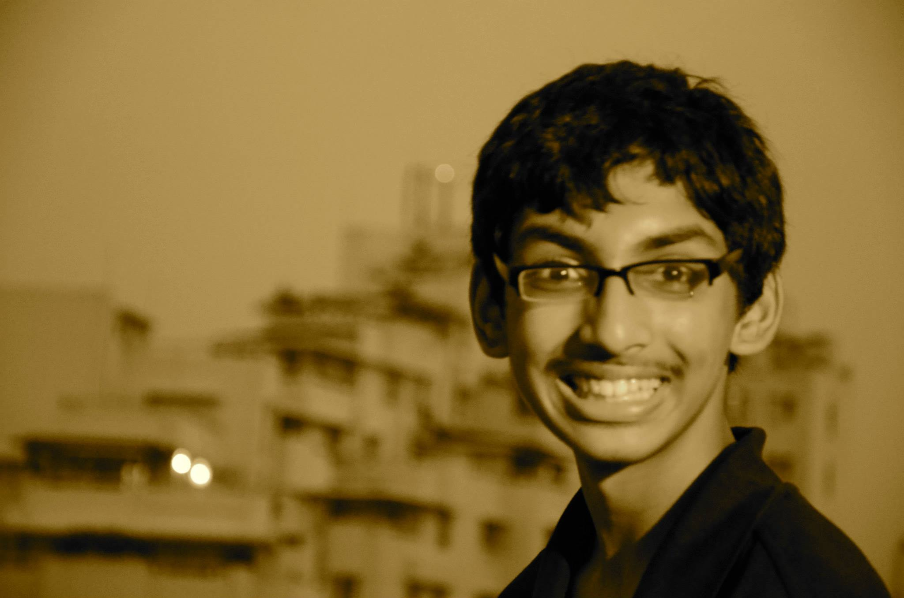
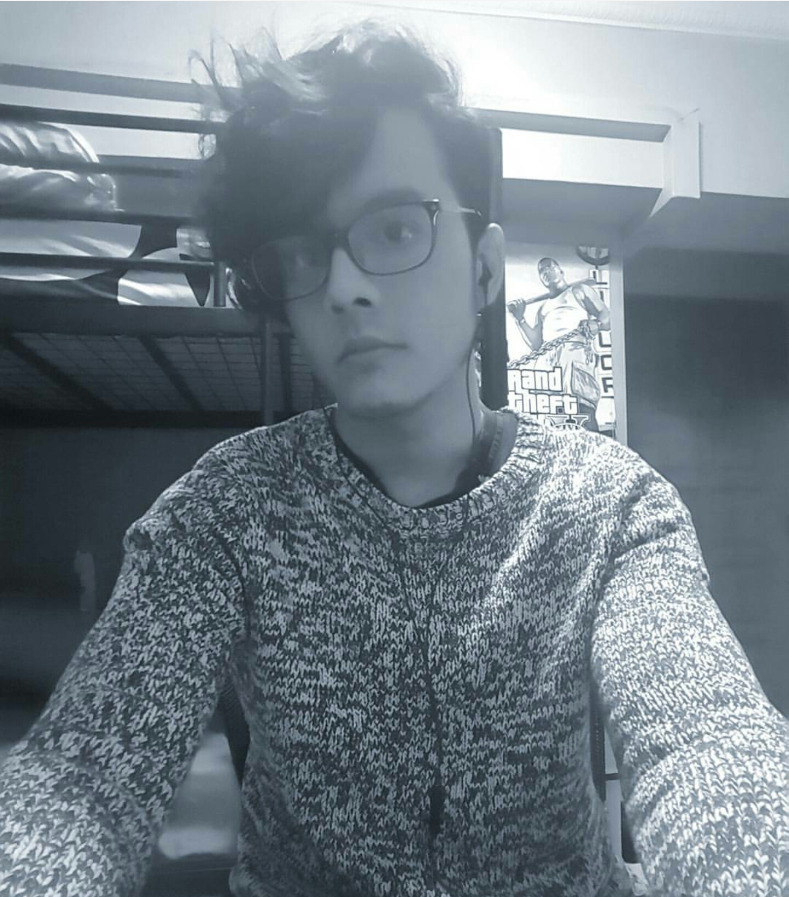
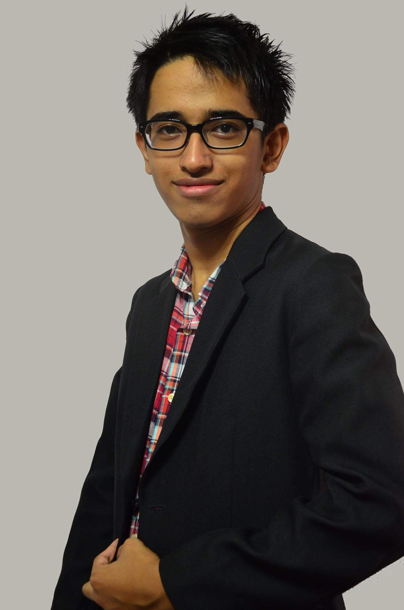
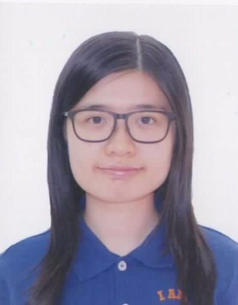
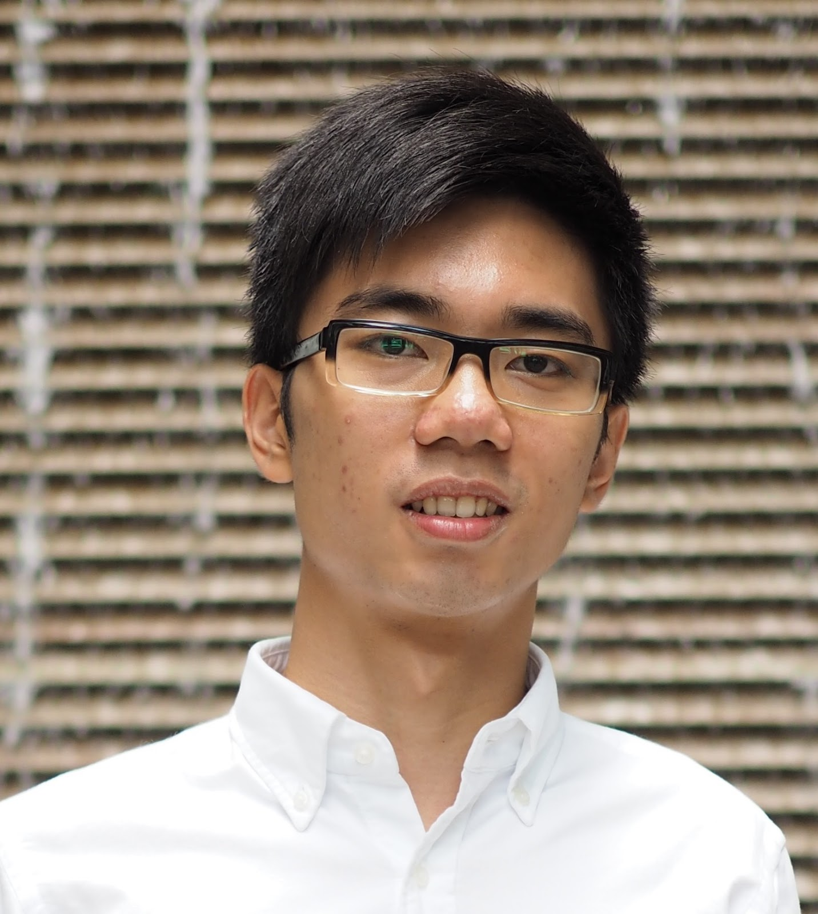

# About Us

We are a team of students studying CS2103 based in the [School of Computing, National University of Singapore](http://www.comp.nus.edu.sg).

## Project Team

#### [Advay Pal](https://github.com/advaypal)
 
* Components in charge of: [Storage](https://github.com/CS2103AUG2016-T14-C4/main/blob/master/docs/DeveloperGuide.md#storage-component), [Model](https://github.com/CS2103AUG2016-T14-C4/main/blob/master/docs/DeveloperGuide.md#model-component)
* Features implemented: 
	* [Support for non floating task and integration of Date Time Model](https://github.com/CS2103AUG2016-T14-C4/main/pull/45)
	* [Ability to Change Storage](https://github.com/CS2103AUG2016-T14-C4/main/pull/64)
	* [More natural commands]()
	* [Google Calendar Integration(IP)]()
* Code written: [[functional code]()][[test code]()][[docs]()]
* Other major contributions:
  * Did the initial refactoring from AddressBook to ToDoList [[#39](https://github.com/CS2103AUG2016-T14-C4/main/pull/39) ]
  * Set up Codacy

-----

#### [Abdul Haliq](https://github.com/AHaliq)
 
Role: Developer    
Responsibilities: UI, scheduling and tracking

-----

#### [Syed Abdullah](https://github.com/Skaty)
 
Role: Developer    
Responsibilities: Code quality,integration,logic

-----

#### [Tsang Cheuk Ling](https://github.com/SukiTsang)
 
Role: Developer    
Responsibilities: Documentation, deliverables and deadlines

 -----

# Project Mentor

#### Cheng Hang
 

