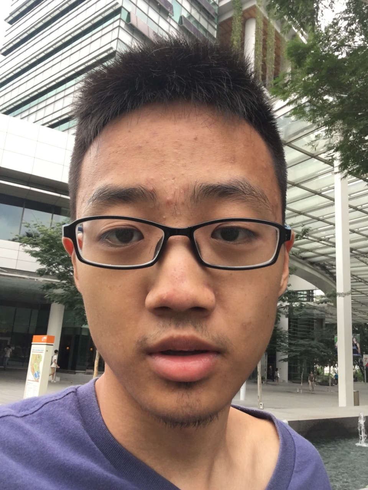

# About Us

We are team T17-C3 for module CS2103 Software Engineering based in the [School of Computing, National University of Singapore](http://www.comp.nus.edu.sg).

## Project Mentor

#### [Tyson Quek](http://github.com/pixelducky)
 
**Role**: Tutor  
Responsibilities: Team Mentor

-----

## Project Team
  
#### [Musa Bin Rahamat](http://github.com/ghurabah93) 
 

* Components in charge of: [Logic]
* Features implemented:
   * <kbd>[Undo](docs/UserGuide.md#undo-the-modification--undo)</kbd> Command
   * <kbd>[Done](docs/UserGuide.md#done-a-specific-task--done)</kbd> Command
   * <kbd>[Undone](docs/UserGuide.md#undone-a-specific-task--undone)</kbd> Command
* Code written: <kbd>[Functional code](collated/main/A0147335E.md)</kbd> <kbd>[Test code](collated/test/A0147335E.md)</kbd> <kbd>[Docs]</kbd>
* Other major contributions:
  * Did the initial refactoring from AddressBook to TaskManager
  * Did the initial refactoring of testing from AddressBook to TaskManager
  
**Role**: Developer  
Responsibilities: Team Lead, Logic

-----

#### [Yan Nuoyuan](http://github.com/nyannnnnnn)
 

* Components in charge of: [Add command]
* Features implemented:
   * <kbd>[Add](docs/UserGuide.md#add-the-modification--undo)</kbd> Command
   * <kbd> [Natural input using natty]
* Code written: <kbd>[Functional code](collated/main/A0152958R.md)</kbd>

**Role**: Developer  
Responsibilities: Code Quality, Parser

-----

#### [Han Xue](http://github.com/Hanxnow77)
 
**Role**: Developer  
Responsibilities: Testing, GUI

-----

#### [Lim Jun Hao](http://github.com/evilmtv)
 

* Components in charge of: [Storage]
* Features implemented:
   * <kbd>[Backup](docs/UserGuide.md#backup--backup)</kbd> Command
   * <kbd>[Directory](docs/UserGuide.md#change-working-directory--directory)</kbd> Command
* Code written: <kbd>[Functional code](collated/main/A0147944U.md)</kbd> <kbd>[Test code](collated/test/A0147944U.md)</kbd> <kbd>[Docs](collated/docs/A0147944U.md)</kbd>
* Other major contributions:
  * Organize and manage [GitHub repository](https://github.com/CS2103AUG2016-T17-C3/main)
  * Improve Regex for CommandParser
  * Edit and ensure formatting of documentations
  
**Role**: Developer  
Responsibilities: Integration, Storage Commands, GitHub Project Manager

-----
