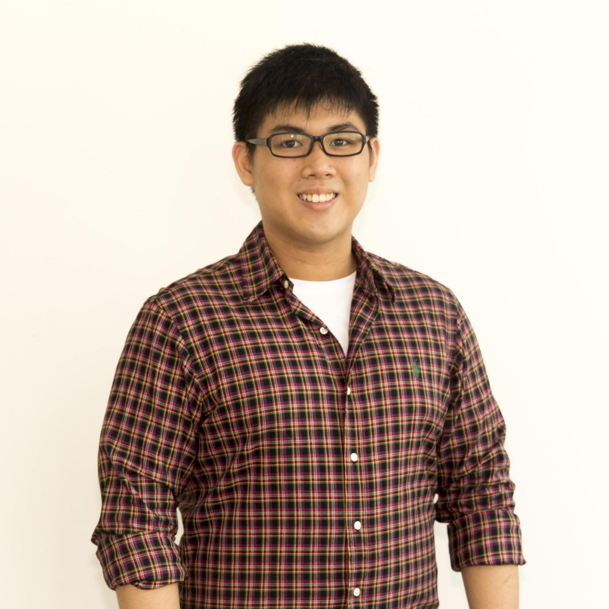

# About Us

We are a team based in the [School of Computing, National University of Singapore](http://www.comp.nus.edu.sg).

## Project Team

#### [Gary Goh](https://github.com/garygjy)
 

* Role: Developer  
* Components in charge of: Model  
* Features Implemented:
  * [Edit Command](https://github.com/CS2103AUG2016-T09-C4/main/blob/master/docs/UserGuide.md#4-edit-command)
  * [Undo Command](https://github.com/CS2103AUG2016-T09-C4/main/blob/master/docs/UserGuide.md#10-undo-command)
  * [Redo Command](https://github.com/CS2103AUG2016-T09-C4/main/blob/master/docs/UserGuide.md#11-redo-command)
  * [SetDirectory Command]()
* Code Written: [[functional code](A0139714.md)][[test code](A0139714B.md)][[docs](A0139714B.md)]
* Other Major Contributions:
 * Did the initial refactoring from AddressBook to Unburden [[#133](https://github.com/se-edu/addressbook-level4/pull/152) ]
 * Set up Travis and Coveralls

-----

#### [Nathanael Chan](https://github.com/nat1994)
 

* Role: Developer  
* Component in charge of: Logic
* Features implemented: 
  * [Add Command](https://github.com/CS2103AUG2016-T09-C4/main/blob/master/docs/UserGuide.md#2-add-command-add)
  * [Find Command](https://github.com/CS2103AUG2016-T09-C4/main/blob/master/docs/UserGuide.md#8-find-command)
  * [List Command](https://github.com/CS2103AUG2016-T09-C4/main/blob/master/docs/UserGuide.md#7-list-command)
  * [Clear Command](https://github.com/CS2103AUG2016-T09-C4/main/blob/master/docs/UserGuide.md#9-clear-command)
* Code Written: [[functional code](A0139678J.md)][test code](A0139678J.md)][[docs](A0139678J.md)]
 
-----

#### [Gauri Joshi](https://github.com/gaurzzz)
 
 
* Role: Developer  
* Component in charge of: Storage
* Features implemented: 
  * [Done Command](https://github.com/CS2103AUG2016-T09-C4/main/blob/master/docs/UserGuide.md#5-done-command)
  * [UnDone Command](https://github.com/CS2103AUG2016-T09-C4/main/blob/master/docs/UserGuide.md#6-undone-command)
* Code Written: [[functional code](A0143095H.md)][test code](A0143095H.md)][[docs](A0143095H.md)]
* Other major contributions: 
  * Created the various classes for seedu.unburden.model.task package (e.g Date, Name, Time, Task and Task Description classed)
  * Redesigned the GUI for the application, Unburden
-----

#### [Lu Hua]
 
 
* Role: Developer  
* Component in charge of: UI
* Unused Features implemented:

 
-----

## Tutor

#### [Sam Yong](https://github.com/se-edu/addressbook-level4/pulls?q=is%3Apr+author%3Amauris)
  

# Contributors

We welcome contributions. See [Contact Us](ContactUs.md) page for more info.

* [Akshay Narayan](https://github.com/se-edu/addressbook-level4/pulls?q=is%3Apr+author%3Aokkhoy)

