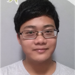

# About Us

We are a group of Computer Science students from the School of Computing, National University of Singapore.

## Project Team

#### [Jia Wern](https://github.com/l0g1cal) 

 
* Role: Developer 
* Responsibilities: Team Lead 
* Component in charge of: Model
* Features implemented:
   * [Edit task](https://github.com/CS2103AUG2016-W14-C4/main/blob/master/docs/UserGuide.md#edit-task-details-edit)
   * [Save to specified folder](https://github.com/CS2103AUG2016-W14-C4/main/blob/master/docs/UserGuide.md#save-data-save)
* Code written: [[functional code](https://github.com/CS2103AUG2016-W14-C4/main/blob/master/collated/main/A0135793W.md)][[test code](https://github.com/CS2103AUG2016-W14-C4/main/blob/master/collated/test/A0135793W.md)][[docs](A123456.md)]
* Other major contributions:
  * Did the initial refactoring from AddressBook to ToDoList [[Refactoring commit](https://github.com/CS2103AUG2016-W14-C4/main/commit/62ca81ca63ae4de3be12766f60b4ee9d1a2d6956)]
  * Tidy up format and language for developer guide [[Commit] (https://github.com/CS2103AUG2016-W14-C4/main/commit/0d1c8b13dba00303e4a0af567678fe41dab2e842)]

-----

#### [Ian Teo](https://github.com/IanTeo) 

 
* Role: Developer 
* Responsibilities: Integration 
* In charge of: Storage

-----

#### [Rachel Yang](https://github.com/JJ-Rachel) 

 
* Role: Developer 
* Responsibilities: Code Quality 
* In charge of: UI

-----

#### [Jun An](https://github.com/yamidark) 

 
* Role: Developer 
* Responsibilities: Testing 
* In charge of: Logic

#### Michelle

 
* Role: Tutor 
