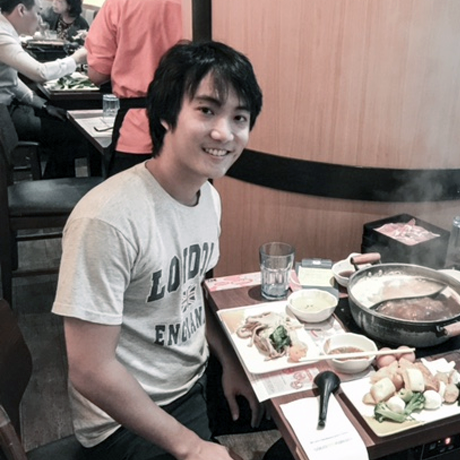

# About Us

## Project Team

#### [Akshay Narayan](https://github.com/okkhoy)
 
**Role**: Project Mentor  

-----

#### [Nishant Budhdev](https://github.com/nishantbudhdev)
 
**Role**: Project Mentor  

-----

#### [Chen Rui Wen](http://github.com/ruiwen905) 
 
**Role**: Developer    
Responsibilities: Team Lead 
Component SME: UI

-----

#### [Low Zheng Heng Henry](http://github.com/e0003801)
 
**Role**: Developer    
Responsibilities: Documentation, Code Quality  
Component SME: Logic, Parsing

-----

#### [Ng Qing Hua](http://github.com/qhng)  
 
**Role**: Developer  
* Components in charge of: [Storage](DeveloperGuide.md#storage-component), [Model](DeveloperGuide.md#model-component)
* Aspects/tools in charge of: Testing, Deliverables and Deadlines
* Features implemented:
   * [Add task](UserGuide.md#adding-a-task-add)
   * [List task](UserGuide.md#listing-all-tasks-list)
   * [Find task](UserGuide.md#finding-all-task-containing-any-keyword-in-its-name-find)
   * [Delete task](UserGuide.md#deleting-a-task--delete)
   * [Modify task](UserGuide.md#modifies-a-task--modify)
* Code written: [[functional code](../collated/main/A0139915W.md)][[test code](../collated/main/A0139915W.md)][[docs](../collated/docs/A0139915W.md)]
* Other major contributions:
  * Did the initial refactoring from AddressBook to SavvyTasker [[#34](https://github.com/CS2103AUG2016-T14-C2/main/pull/34) ]
  * Set up Travis and Coveralls 

-----

#### [Teh Ee Thai](http://github.com/tet54)
 
**Role**: Developer    
Responsibilities: Integration  
Component SME: Model, Storage
 
 -----
