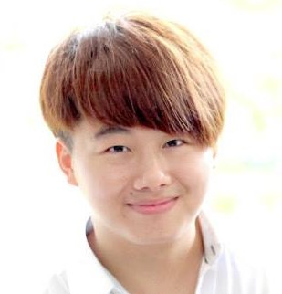

# About Us

We are a team based in the [School of Computing, National University of Singapore](http://www.comp.nus.edu.sg).

## Project Team

#### [Bernard Koh](http://github.com/bernardified)  
 
Role: Developer    
Responsibilities: Team Leader, Testing  
In-Charge: Logic

-----

#### [Leah Lim](http://github.com/leahlim)
 
Role: Developer    
Responsibilities: Documentation, GUI Design  
In-Charge: UI

-----

#### [Liu Zhen Dong](http://github.com/dongxuandong) 
 

* Components in charge of: [Storage](https://github.com/CS2103AUG2016-W13-C2/main/blob/master/docs/DeveloperGuide.md#storage-component)
* Aspects/tools in charge of: Code Quality, Command Developer, User and Developer Guide Developer
* Features implemented:
   * [Undo](https://github.com/CS2103AUG2016-W13-C2/main/blob/master/docs/UserGuide.md#undo-undo)
   * [Redo](https://github.com/CS2103AUG2016-W13-C2/main/blob/master/docs/UserGuide.md#redo-redo) 
* Code written: [[functional code](https://github.com/CS2103AUG2016-W13-C2/main/blob/master/collated/main/A0138420N.md)][[test code]][[docs](https://github.com/CS2103AUG2016-W13-C2/main/blob/master/collated/docs/A0138420N.md)] 
* Other major contributions:
  * Aided in the initial refactoring from AddressBook test cases to GGist test cases
  * Developed and edited the user guide to make it user friendly
  * Edited and proofread the developer guide
  * Enhanced the functionality of delete command to delete multiple tasks[[#106](https://github.com/CS2103AUG2016-W13-C2/main/issues/106)]
  * Enhanced the functionality of done command to mark multiple tasks as done[[#109](https://github.com/CS2103AUG2016-W13-C2/main/issues/109)]
  * Improved the functionality of edit command to edit multiple fields
-----

#### [Li Wang Huan](http://github.com/liwanghuan)
 
Role: Developer    
Responsibilities: Integration, Eclipse Specialist  
In-charge: Model

-----

#### Project Mentor: [Akshay Narayan](https://github.com/okkhoy)
 

# Contributors

We welcome contributions. See [Contact Us](ContactUs.md) page for more info.

* [Akshay Narayan](https://github.com/se-edu/addressbook-level4/pulls?q=is%3Apr+author%3Aokkhoy)
* [Sam Yong](https://github.com/se-edu/addressbook-level4/pulls?q=is%3Apr+author%3Amauris)