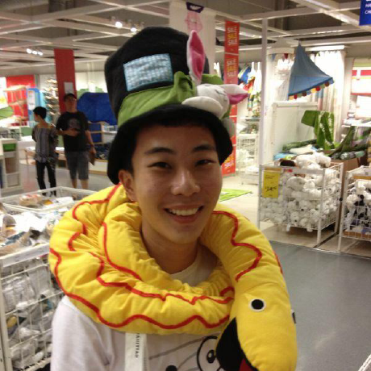

# About Us

## Project Team

#### [Akshay Narayan](https://github.com/okkhoy)
 
**Role**: Project Mentor  

-----

#### [Nishant Budhdev](https://github.com/nishantbudhdev)
 
**Role**: Project Mentor  

-----

#### [Chen Rui Wen](http://github.com/ruiwen905) 
 
**Role**: Developer    
Responsibilities:  
Component SME: UI

-----

#### [Low Zheng Heng Henry](http://github.com/e0003801)
 
**Role**: Developer    
Responsibilities: Documentation, Code Quality  
Component SME: Logic

-----

#### [Ng Qing Hua](http://github.com/qhng)  
 
**Role**: Developer  
Responsibilities: Testing, Deliverables and Deadlines  
Component SME: Model, Commons

-----

#### [Teh Ee Thai](http://github.com/tet54)
 
**Role**: Developer    
Responsibilities: Integration  
Component SME: Model, Storage
 
 -----
