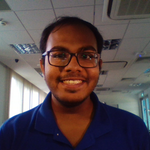

# About Us

We are a team of students based in the [School of Computing, National University of Singapore](http://www.comp.nus.edu.sg).

## Project Team

#### [Dhruv Jain](http://github.com/microcerebus)  
 
**Role**: Team Lead, Documentation, Deliverables 

Responsibilities: Model

-----

#### [Ashley Ong](http://github.com/ashleyyy94)
 
**Role**: Integration, Github Manager, Scheduling and Tracking    

Responsibilities: Logic

-----

#### [Chen Sidai](http://github.com/sidai) 
 
**Role**: Code Quality  

Responsibilities: UI

-----

#### [Zachary Foo](http://github.com/StylishGoldPen)
 
**Role**: Testing, Integration    

Responsibilities: Storage

-----
## Project Mentor
#### Nirandika Wanigasekara
 

-----
# Contributors

We welcome contributions. See [Contact Us](ContactUs.md) page for more info.