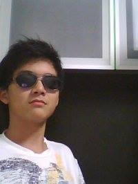

# About Us

We are a team of four Computer Engineering students based in the [School of Computing, National University of Singapore](http://www.comp.nus.edu.sg). 

## Project Team

#### [**Low Yong Cheng**](https://github.com/yongchenglow)
**Role**: Team Leader 
Team Leader: responsible for overall project coordination. 
Documentation: ensure quality of various project documents.

-----

### [**Liu Yuheng**](https://github.com/E0003705)
 
**Role**:  Group member 
Debugger: responsible for checking for bugs in all codes. 
Tools expert: advance knowledge on tools used and helps with tools related problems.

-----

### [**Marcus Yatim**](https://github.com/a0124453)
**Role**: Group member 
Integration: integrate various parts of the software to create a whole. 
Scheduling: in charge of assigning and tracking project tasks.

-----

### [**Raphael Quek**](https://github.com/raphaelquek)
**Role**: Group member 
Testing: ensures the testing of the project is done properly and on time. 
Code quality: looks after the code quality, ensures adherence to code standards.

-----

#Project Mentor
#### [**Sam Yong**](https://github.com/mauris)
  
 
------

## Contribute

We welcome contributions. See [Contact Us](ContactUs.md) page for more info.
