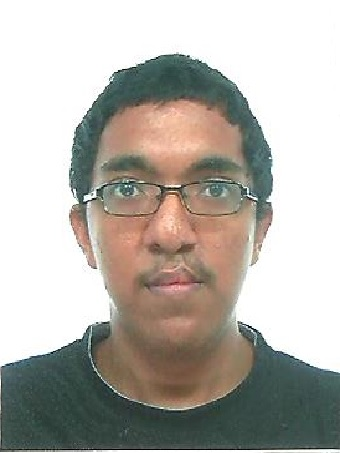

# About Us

We are team T17-C3 for module CS2103 Software Engineering based in the [School of Computing, National University of Singapore](http://www.comp.nus.edu.sg).

## Project Mentor

#### [Tyson Quek](http://github.com/pixelducky)
 
**Role**: Tutor  
Responsibilities: Team Mentor

-----

## Project Team

* Aspects/tools in charge of: Testing, Git
* Features implemented:
   * [List persons](https://github.com/se-edu/addressbook-level4/blob/master/docs/UserGuide.md#listing-all-persons--list)
   * [Delete person](https://github.com/se-edu/addressbook-level4/blob/master/docs/UserGuide.md#deleting-a-person--delete)
* Code written: [[functional code](A123456.md)][[test code](A123456.md)][[docs](A123456.md)]
* Other major contributions:
  * Did the initial refactoring from AddressBook to ToDoList [[#133](https://github.com/se-edu/addressbook-level4/pull/152) ]
  * Set up Travis and Coveralls 
  
  
#### [Musa Bin Rahamat](http://github.com/ghurabah93) 
 

* Components in charge of: [Logic]
* Features implemented:
   * [Undo Command]
   * [Done Commmand]
   * [Undone Command]
* Code written: [functional code][test code][docs]
* Other major contributions:
  * Did the initial refactoring from AddressBook to TaskManager
  * Did the initial refactoring of testing from AddressBook to TaskManager
  
**Role**: Developer  
Responsibilities: Team Lead, Logic

-----

#### [Yan Nuoyuan](http://github.com/nyannnnnnn)
 
**Role**: Developer  
Responsibilities: Code Quality, Parser

-----

#### [Han Xue](http://github.com/Hanxnow77)
 
**Role**: Developer  
Responsibilities: Testing, GUI

-----

#### [Lim Jun Hao](http://github.com/evilmtv)
 
**Role**: Developer  
Responsibilities: Integration, Storage

-----
