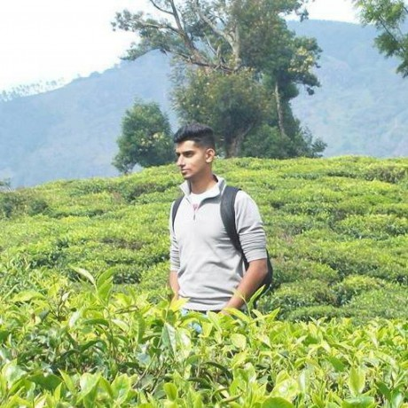
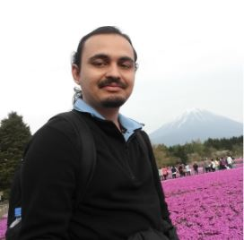

# About Us

We are a team of 3 Year 2 NUS students from SoC.

## Project Team

#### [Praveer Tewari] (http://github.com/praveer922)  
 
**Role**:  Team lead, in charge of Model component, UI component 
Components in charge of :  `Parser`, `Model`, `UI` 
Aspects/tools in charge of: Git, UI component 
Features implemented: 
>Add tasks
>Edit tasks
>Clear tasks
>Select tasks
>Delete tasks
>Delete completed tasks
>Undo Tasks 
Other major contributions:
>Learning and teaching Javafx to design GUI
>Source out and introduced external libraries e.g. natty
>Fix bugs
-----

#### [Teo Ming Yi](http://github.com/myteo)
 
Role: Testing, Integration, in charge of Logic component 
Components in charge of : `test` , `Command`, `Logic` 
Aspects/tools in charge of: Testing, Code quality 
Features implemented:  
>Show Tasks
>Find Task
>Pin Tasks
>Unpin Tasks
>Complete Tasks
>Uncomplete Tasks
>Sort Tasks  
Other major contributions: 
>Refactoring and refinement of code 
>Set up Travis and Coveralls
-----

#### [Zhuang Yufeng](http://github.com/rainwindy) 
 
Role: ode quality, Scheduling and Tracking 
Components in charge of : `Util` , `collated` , `docs` , `History` 
Aspects/tools in charge of: Documentation, Code quality, Scheduling and Tracking   
Features implemented:
> Undo
> Edit Tasks
> Help Window 
> Check for clashing time slot 
Other major contributions:
> Diagrams
> Collate
-----

#### [Muthu Kumar Chandrasekaran] (https://github.com/cmkumar87)
 
Role: Mentor

-----

